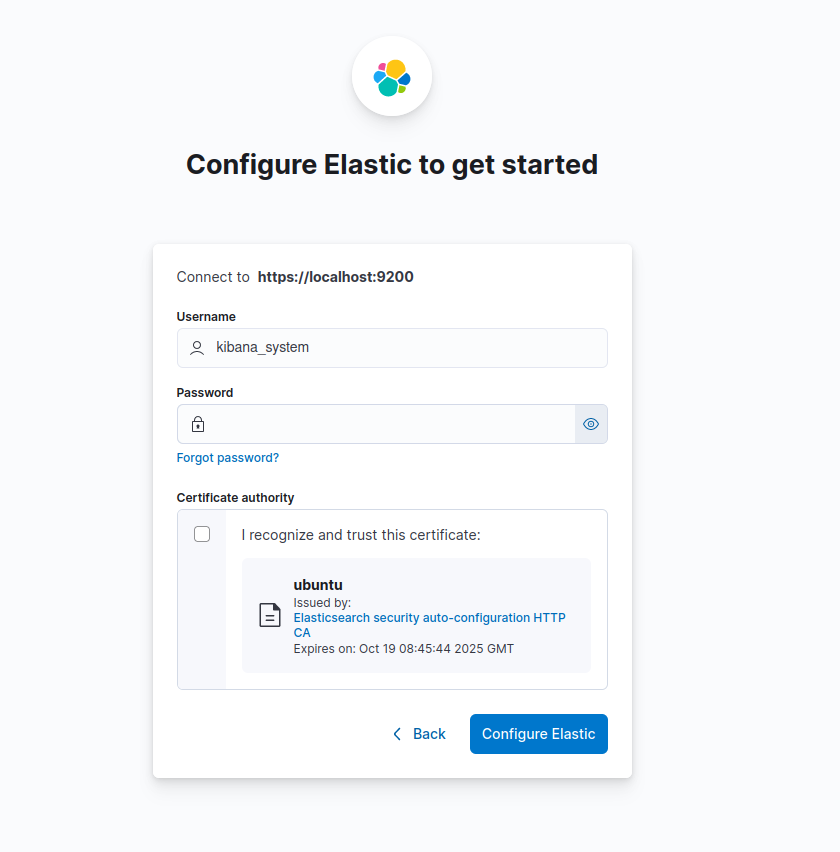

# Install Elasticsearch and Kibana on Linux

## Prerequisites

The Elastic repository is not included in the default `apt` repository. Therefore, you need to install the repository first, and then install the required packages:

1. Import the Elastic PGP Key. This is the key used to sign all their packages.
    
    ```Bash
    wget -qO - https://artifacts.elastic.co/GPG-KEY-elasticsearch | sudo gpg --dearmor -o /usr/share/keyrings/elasticsearch-keyring.gpg
    ```
    
2. Install the `apt-transport-https` package.
    
    ```Bash
    sudo apt install apt-transport-https
    ```
    
3. Install the Elastic repository.
    
    ```Bash
    echo "deb [signed-by=/usr/share/keyrings/elasticsearch-keyring.gpg] https://artifacts.elastic.co/packages/8.x/apt stable main" | sudo tee /etc/apt/sources.list.d/elastic-8.x.list
    ```
    
4. Update the `apt` records.
    
    ```Bash
    sudo apt update
    ```
    

## Installing `elasticsearch`

Now we are ready to install the components of the Elastic Stack:

1. Install `elasticsearch` from `apt`.
    
    ```Bash
    sudo apt install elasticsearch
    ```
    
2. Configure the `elasticsearch` service to start when the machine boots.
    
    ```Bash
    systemctl enable elasticsearch
    ```
    
3. Start the `elasticsearch` service.
    
    ```Bash
    systemctl start elasticsearch
    ```

4. To run the service as a cluster, you need to edit the configuration file `/etc/elasticsearch/elasticsearch.yml`.
    
    The file starts like this:
    
    ```yaml
    # ======================== Elasticsearch Configuration =========================
    #
    # NOTE: Elasticsearch comes with reasonable defaults for most settings.
    #       Before you set out to tweak and tune the configuration, make sure you
    #       understand what are you trying to accomplish and the consequences.
    #
    # The primary way of configuring a node is via this file...
    ```
    
    For cluster configuration, let's suppose the IPs of the nodes are `10.1.102.178` and `10.1.103.227`.
    
    You should overwrite the file with the following:
    
    ```yaml
    path.data: /var/lib/elasticsearch
    path.logs: /var/log/elasticsearch

    xpack.security.enabled: false
    xpack.security.enrollment.enabled: true
    http.host: 0.0.0.0

    # Disable SSL configuration
    xpack.security.transport.ssl.enabled: false
    xpack.security.http.ssl.enabled: false

    # Nodes can act as master, data, and ingest nodes
    node.roles: [master, data, ingest]
    node.name: ip-10-1-103-227

    # This option disables swapping to improve performance (set to true). Leave enabled on hosts with low memory.
    bootstrap.memory_lock: false

    # Loopback and the private IP address of the current node
    network.host: [127.0.0.1, 10.1.103.227]

    cluster.name: elk_cluster

    # All node names that are eligible as master nodes
    cluster.initial_master_nodes: ["ip-10-1-102-178", "ip-10-1-103-227"]
    # All node IPs
    discovery.seed_hosts: ["10.1.102.178", "10.1.103.227"]
    ```

    You can access the YAML configuration file used in this example at `/files/linux/elasticsearch.yml` in this repository.
    

## Installing `kibana`

1. Install `kibana` from `apt`.
    
    ```
    sudo apt install kibana
    ```
    
2. Configure the `kibana` service to start when the machine boots.
    
    ```Bash
    systemctl enable kibana
    ```
    
3. Start the `kibana` service.
    
    ```Bash
    systemctl start kibana
    ```
    

## Configuring the Kibana dashboard

> [!NOTE]  
> You should use Nginx or any reverse proxy to expose the Kibana dashboard, which runs on port `5601`. For this example, suppose the dashboard is exposed via the URL `kibana.example.com`.

1. Go to `http://kibana.example.com`. You will see the following configuration page:
    
    
    
    You can configure Kibana using an Enrollment Token or a username and password. The method depends on how much control you want over the configuration. Additionally, it is recommended to use the Enrollment Token if Kibana and Elasticsearch are not running on the same host. In our case, we will go for the manual configuration.
    
2. Click the “Configure manually” button. You will see the following page:
    
    
    
3. Click “Check address” so Kibana tries to connect to Elasticsearch. You will see the following screen:
    
    
    
    This modal will only appear if Elasticsearch has security features enabled. If they are not enabled, you will be able to access Kibana without any problems, without needing to create any user. You will just need to validate access to the server where it is hosted as explained in step 5.
    
4. Obtain the password for the `kibana_system` user by running:
    
    ```Bash
    sudo /usr/share/elasticsearch/bin/elasticsearch-reset-password --username kibana_system
    ```
    
    Once obtained, paste it into the appropriate field and click “Configure Elastic”.
    
5. You will be asked for a verification code, which you will obtain with the following command:
    
    
    
    ```Bash
    sudo /usr/share/kibana/bin/kibana-verification-code
    ```
    
6. After waiting for all configurations to apply, you will be asked to log in. For this, you need a user.
    
    ```Bash
    sudo /usr/share/elasticsearch/bin/elasticsearch-users useradd johndoe -r superuser
    ```
    
    We recommend generating the password using the following command: `pwgen -cnsy -N 1`
    
7. With this user, you will be able to access the Elastic dashboard.

### Roles and permissions

> [!IMPORTANT]  
> These configurations will only be available if the Elasticsearch cluster is configured with security enabled. Otherwise, just obtaining the Kibana dashboard URL will allow access without any issues.

From an account with superuser permissions, you can create new roles, create users, and create workspaces for those users. To configure all this:

1. Open the left side menu
2. Click Management > Stack Management
3. Within the Security group, click Roles

There you can specify all permissions for each section of Kibana and its integration with Elasticsearch.

Then, you can create a user by clicking, within the Security group, the Users button. You must assign a role from the built-in roles or the custom roles you created earlier.