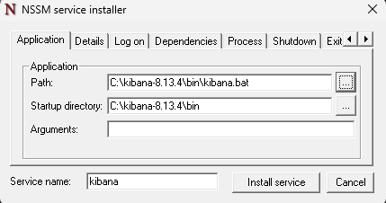
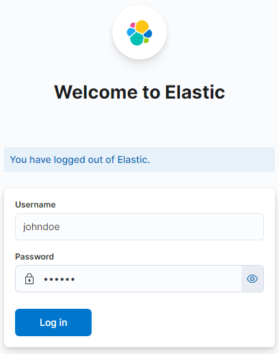
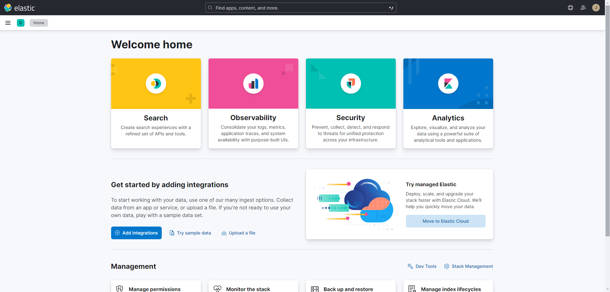

# Installing Elasticsearch and Kibana on Windows

In this document, we'll see how to install and run `elasticsearch` and `kibana` as services.

> [!NOTE]
> In both cases, we'll be working in the folder `C:\program-version-number`.

> [!IMPORTANT]  
> For our AWS configuration, only the sections present in the document named `using-logstash-in-windows.md` were needed. The configurations for `elasticsearch` and `kibana` were performed on EC2 Ubuntu instances, so this document only shows the configuration of them in the local environment.

## Installing `elasticsearch`

1. Download `elasticsearch` from the page:
    
    [Install Elasticsearch with .zip on Windows | Elasticsearch Guide [8.13] | Elastic](https://www.elastic.co/guide/en/elasticsearch/reference/8.13/zip-windows.html)
    
2. Unzip the downloaded `.zip` file and navigate to the corresponding folder. In our case, we'll go to `C:\elasticsearch-8.13.4`.
3. Open a terminal as administrator and navigate to the folder `C:\elasticsearch-8.13.4\bin`. Run the `.\elasticsearch.bat` file in the terminal to create the service:
    
    ```bash
    C:\elasticsearch-8.13.4\bin> .\elasticsearch-service.bat install
    ```
    > [!NOTE]  
    > If it doesn't work with Command Prompt, try with Windows PowerShell. Don't forget to open it as administrator.

4. In the same terminal, run the following command to start the service in Windows.
    ```bash
    C:\elasticsearch-8.13.4\bin> .\elasticsearch-service.bat start
    ```
    > [!NOTE]  
    > If it doesn't work with Command Prompt, try with Windows PowerShell. Don't forget to open it as administrator.

5. Open another terminal also as administrator, navigate to the folder `C:\elasticsearch-8.13.4\bin`, and run the following command:
    
    ```bash
    C:\elasticsearch-8.13.4\bin> .\elasticsearch-users useradd johndoe -r superuser
    ```
    
    This allows creating a new user with the name `johndoe`, and it will prompt us to enter a password. This will allow us to log in to `kibana` later on. As an example, we chose the following login details:
    
    - User: `johndoe`
    - Password: `123456`

## Installing `kibana`

1. Download `kibana` from the page:
    
    [Install Kibana on Windows | Kibana Guide [8.13] | Elastic](https://www.elastic.co/guide/en/kibana/current/windows.html#windows-enroll)
    
2. Unzip the downloaded `.zip` file and then navigate to the folder `C:\kibana-8.13.4`.
3. Before continuing with `kibana`, we need to go to the folder where the `elasticsearch-reset-password.bat` file is located (in our case, it's located at `C:\elasticsearch-8.13.4\bin\elasticsearch-reset-password.bat`) and open a terminal as administrator to run the following command:
    
    ```text
    >> cd elasticsearch-8.13.4\bin
    >> .\elasticsearch-reset-password.bat -u kibana_system --auto
    warning: ignoring JAVA_HOME=C:\Users\nehue\.jdks\openjdk-20.0.2; using bundled JDK
    This tool will reset the password of the [kibana_system] user to an autogenerated value.
    The password will be printed in the console.
    Please confirm that you would like to continue [y/N]y
    
    Password for the [kibana_system] user successfully reset.
    New value: 6=ODDsGRMseRebDp1W2F
    ```
    
    We'll obtain the password of the `kibana_system` user, which will help us later on.
    
4. Navigate to the `kibana.yml` file in the `C:\elasticsearch-8.13.4\config` folder. Once there, we'll complete it by adding the following lines:
    
    ```yaml
    # =================== System: Elasticsearch ===================
    # The URLs of the Elasticsearch instances to use for all your queries.
    elasticsearch.hosts: ["http://localhost:9200"]

    # If your Elasticsearch is protected with basic authentication, these settings provide
    # the username and password that the Kibana server uses to perform maintenance on the Kibana
    # index at startup. Your Kibana users still need to authenticate with Elasticsearch, which
    # is proxied through the Kibana server.
    elasticsearch.username: "kibana_system"
    elasticsearch.password: "6=ODDsGRMseRebDp1W2F"
    ```
 
5. Download NSSM from the page:
    
    [NSSM - the Non-Sucking Service Manager](https://nssm.cc/download)
    
6. Extract the `nssm.exe` file from the `nssm-<version>\win64\nssm.exe` folder and place it in `C:\kibana-8.13.4\`.
7. Open a terminal as administrator in the `C:\kibana-8.13.4\` folder and run the following command:
   
    ```text
    C:\kibana-8.13.4> .\bin\nssm.exe install kibana
    ```
8. Running the above command brings up an `NSSM service installer` window. In it, we need to specify the following parameters:
    - Path (path to `kibana.bat`): `C:\kibana-8.13.4\bin\kibana.bat`.
    - Startup Directory (path to the `bin` directory): `C:\kibana-8.13.4\bin`.
    - Arguments: leave it empty.
  
    
        
    
    Click **Install service** to create the service.

9. Open a terminal as administrator and run the service we previously created:
    
    ```text
    C:\kibana-8.13.4> Start-Service Kibana
    ```

10. Go to [localhost:5601](https://localhost:5601) and it asks us to log in. To do this, we complete with the following superuser data created previously:
    - User: `johndoe`
    - Password: `123456`
    
    
11. Once inside, we can see the `kibana` menu and we are ready to explore all its features:
    
``
