# Using Kibana

## Prerequisites

Elasticsearch and Kibana must be installed and configured. For more information, see [Installing Elasticsearch and Kibana on Linux](./installing-elasticsearch-and-kibana-in-linux.md). Additionally, most of the tutorials below assume that the data is already in Elasticsearch; when necessary, it will be indicated how to load the data.

## Accessing Kibana

When accessing Kibana, we will see the following welcome page. It is important to remember that Kibana is a web interface, so it is accessed through a web browser. By default, Kibana runs on port `5601`. If exposed through a reverse proxy, it can be accessed via a custom URL.

Upon entry, we will see the following page:

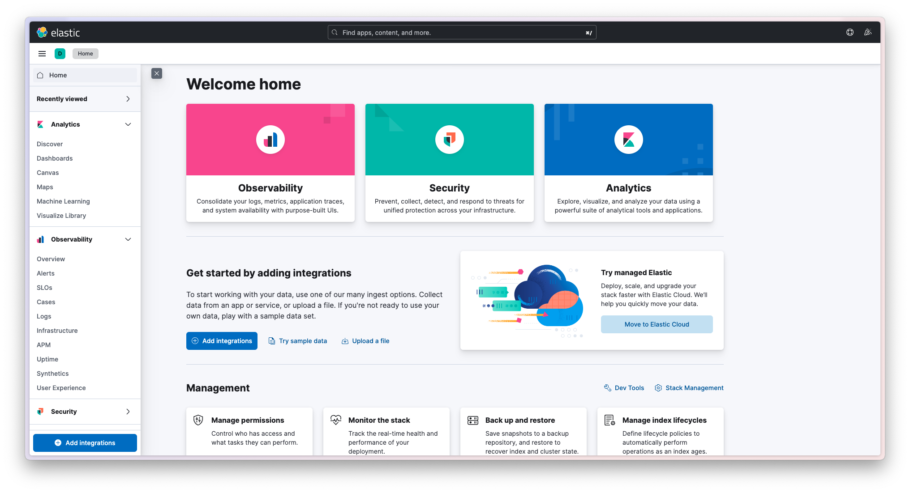

The most important part on this page is the left menu, which contains the different options of Kibana. In the top right corner, there is the help button, which contains links to the official Kibana documentation and the Elastic community.

In the left menu, we will discuss the following main features:

- **Analytics > Discover**: Allows exploring the data stored in Elasticsearch.
- **Analytics > Dashboards**: Allows creating visualizations and charts of the data.
- **Observability > Overview**: Provides an overview of the health of services and applications.
- **Observability > Stream**: Allows viewing the logs of services and applications in real-time.
- **Observability > Alerts**: Enables configuring alerts to monitor services and applications.
- **Observability > Uptime Monitors**: Allows monitoring the availability of services and applications.
- **Management**: Allows managing indices and the main features of Kibana.

> [!TIP]
> Kibana is a stateless web application. It uses the Elasticsearch REST API to interact with data, as well as to save its configurations and visualizations. This allows Kibana to be highly scalable and deployable in a high availability environment. Multiple instances of Kibana can connect to a single Elasticsearch cluster and balance the load between them, without needing to configure all visualizations and dashboards on each instance.

## Analytics

This section focuses on Kibana's data analysis functionalities. In principle, you can explore the data stored in Elasticsearch, create visualizations and charts, and then combine them into a dashboard.

### Discover

The **Discover** option allows exploring the data stored in Elasticsearch. Upon entering this section, we will see a screen similar to the following:

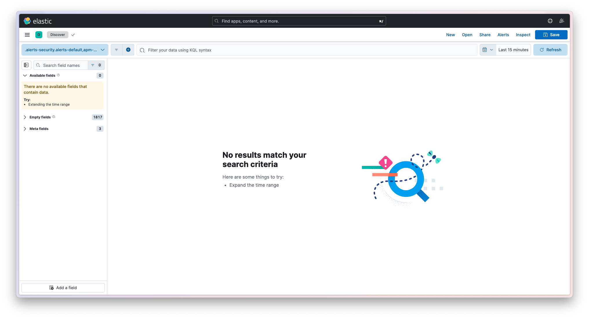

We can see that there is no data yet. This is because we have not created any data view in Kibana, but we are viewing the default one presented to us.

By clicking on the blue button in the top left corner, we will expand all available data views. By selecting each of them, we will see different data corresponding to different Elasticsearch indices.

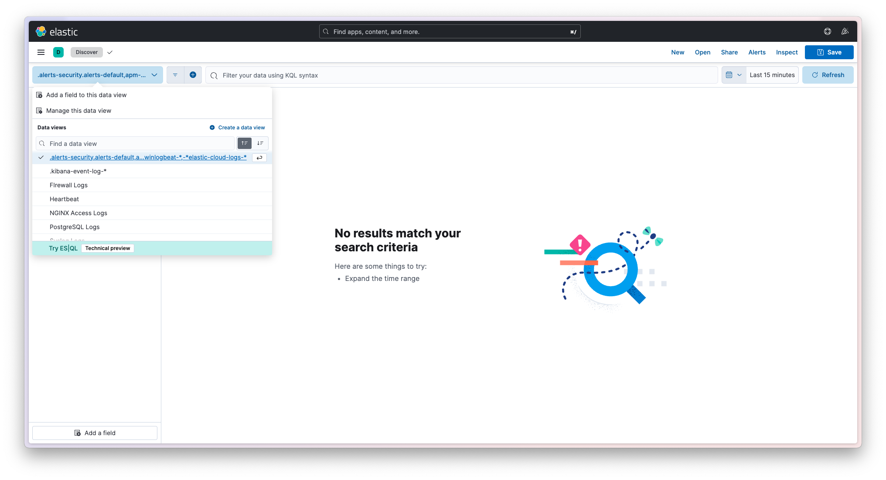

Let's click on the "Create a data view" button to create a new data view. We will be presented with the following panel. Here we can select the Elasticsearch index or indices we want to explore and choose a name for the data view.

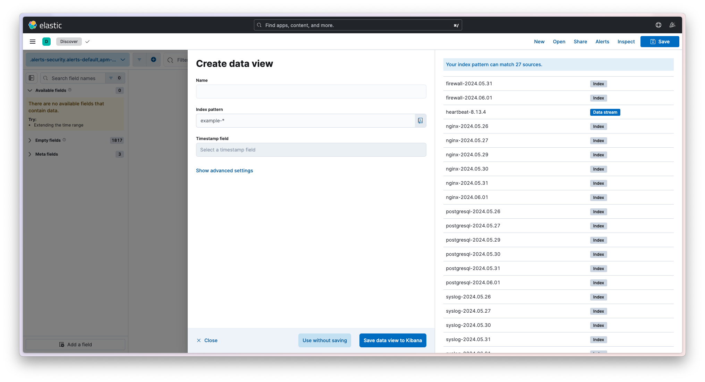

The selection of Elasticsearch indices is done using regular expressions. As mentioned in the tutorial [Installing Elasticsearch and Kibana on Linux](./installing-elasticsearch-and-kibana-in-linux.md), Elasticsearch indices are automatically created, and it is good practice to name them in a way that can be easily identified. For example, if you have web server log data, you could name the indices like `webserver-2024.01.01`, `webserver-2024.01.02`, etc. In that case, the regular expression to view the data associated with those indices would be `webserver-*`.

Once the indices are selected, click on the "Save data view to Kibana" button. If there is data in Elasticsearch, we will see a screen similar to the following:

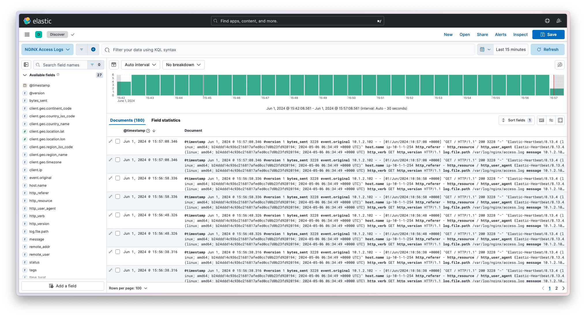

Here we can see the data stored in Elasticsearch. In the left panel, we can see the fields of the data, and we can select which ones we want to see in the table. In the central part, we can see the data itself.

> [!IMPORTANT]
> The available fields will depend on the data stored in Elasticsearch. Consequently, it will depend on the Logstash pipeline used to send the data to Elasticsearch.

At the top, we can see a search field, which allows us to search for specific data using Kibana Query Language (KQL) or Lucene. We can also see a filter field, which allows us to do the same visually.

### Dashboards

The **Dashboards** option allows creating visualizations and charts of the data stored in Elasticsearch, and then combining them into a dashboard. Upon entering this section, we will see a screen similar to the following:

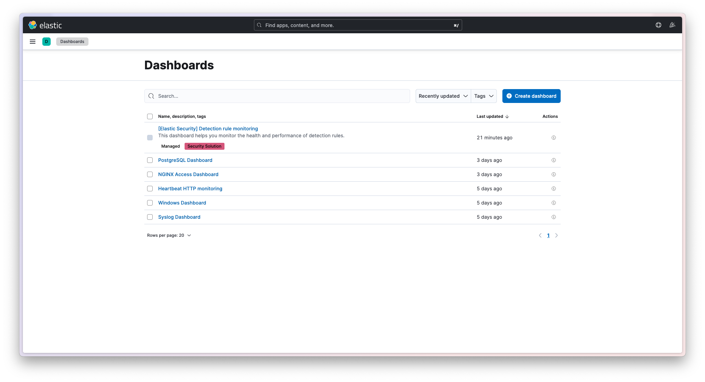

In the image, some dashboards created can be seen. There may be none if this is the first time entering this section. To create a new dashboard, click on the "Create dashboard" button. A blank canvas will be displayed. Once visualizations and charts are created, we will see something similar to the following image:

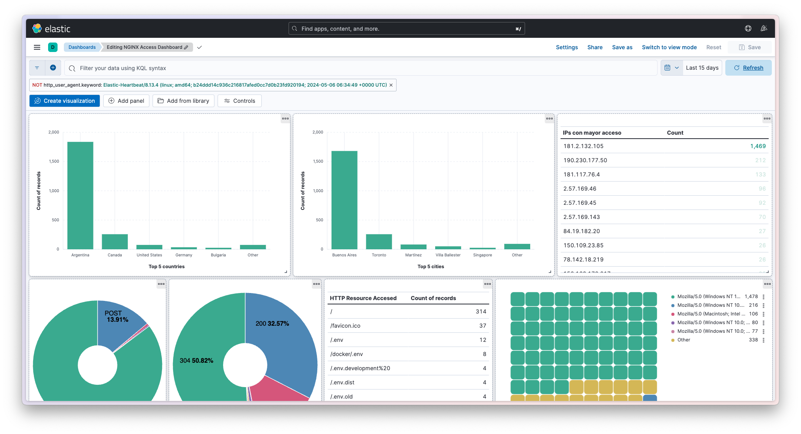

In the top left corner, we can see the "Create visualization" button that allows us to add visualizations and charts to the dashboard. In the top right corner, we can see the "Save" button that allows us to save the dashboard.

To create a visualization, click on the "Create visualization" button. A panel similar to the following will be displayed:

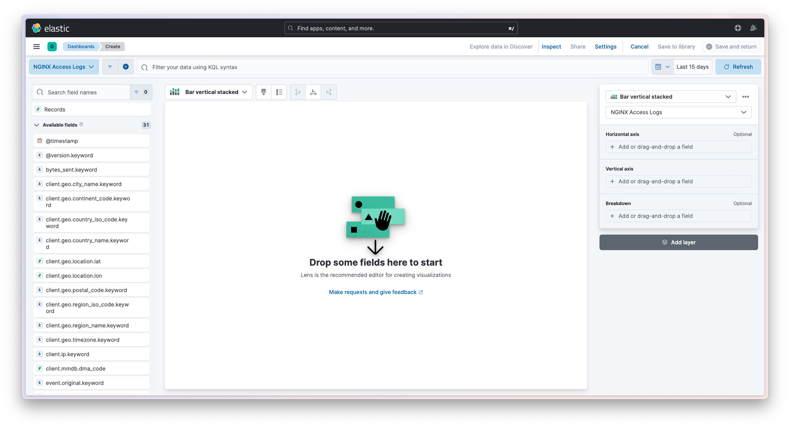

In the left menu, we can see the list of different fields available in the stored data to visualize.

Once we select one, we can see a preview in the center. The selected chart type is the one that best fits the data according to Kibana. At the top, we can see a button that allows us to change the visualization type. Also, at the bottom, we will have the most used options. Finally, in the right panel, we can configure the visualization. The options will depend on the field to visualize and the chart type.

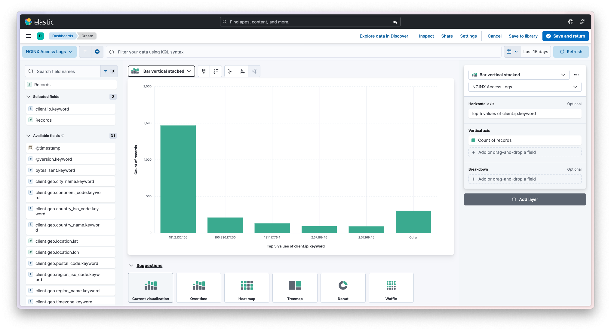

Once we have configured the visualization, click on the "Save and return" button to save it and add it to the dashboard.

It is worth mentioning that Kibana allows you to accurately choose the time period you want to visualize. In the top right corner, we can see a time selection field. By clicking on it, a panel will be displayed allowing us to select the time period we want to visualize, in detail. This is very useful for analyzing trends and behaviors in the data and can be found throughout all sections of Kibana.

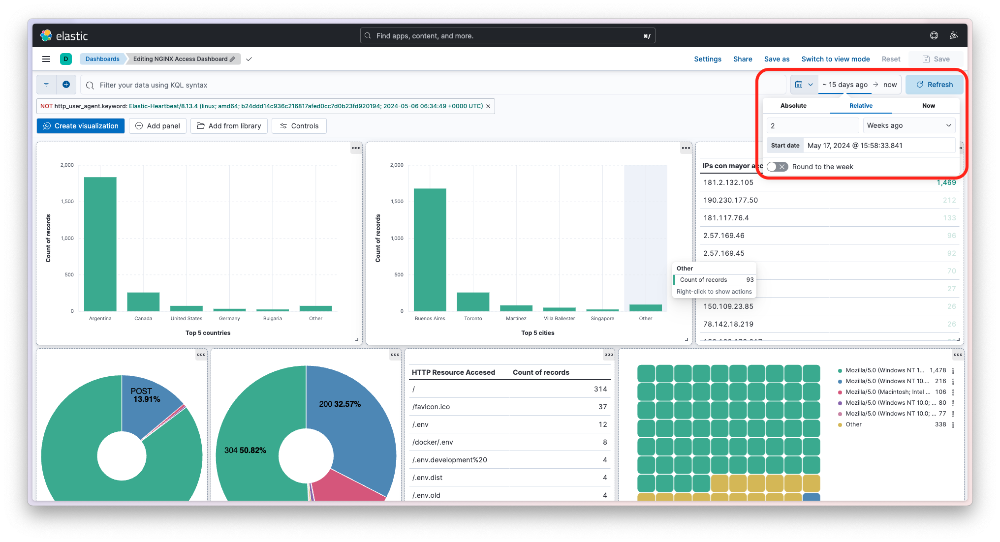

## Observability

This section focuses on Kibana's service and application monitoring functionalities. In principle, you can get an overview of the health of services and applications, view logs in real-time, configure alerts, and monitor the availability of services and applications.

### Overview

The **Overview** option allows getting an overview of the health of services and applications. Upon entering this section, we will see a screen similar to the following:

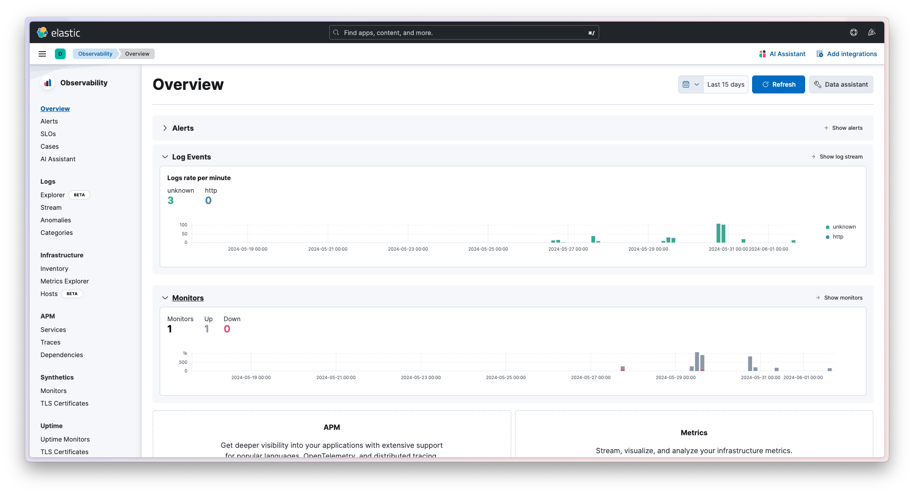

We can see at a glance the number of logs being received in real-time, the number of alerts triggered, and the number of uptime monitors running.

### Stream

The **Stream** option allows viewing the logs of services and applications in real-time. Upon entering this section, we will see a screen similar to the following:

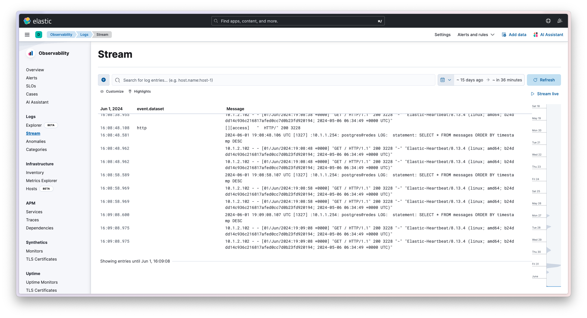

In this screen, we will see everything arriving at Elasticsearch, without any filtering or processing, in order to see in real-time what is happening in the services and applications. For friendlier views or custom filters, it is recommended to use the Analytics section.

### Alerts

> [!IMPORTANT]
> To use Kibana's alerting functionalities, an encryption key must be configured in the Kibana configuration file. This is a string of 32 characters or more used to encrypt sensitive information, such as SMTP server credentials. The following line must be added to the Kibana configuration file, which by default is located at `/etc/kibana/kibana.yml` on Linux: `xpack.encryptedSavedObjects.encryptionKey: "<key>"`. For more information, see the [official Kibana documentation](https://www.elastic.co/guide/en/kibana/current/alert-action-settings-kb.html).

The **Alerts** option allows configuring alerts to monitor services and applications. Upon entering this section, we will see a screen similar to the following:

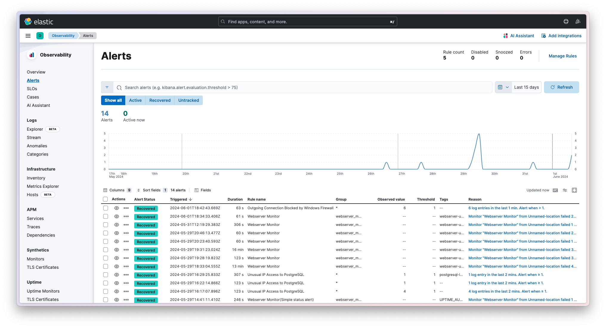

We can see a list of the latest triggered alerts, as well as a chart of alerts triggered over time.

Alerts are configured based on rules, which run periodically and take action if a certain condition is met. To create a new alert, we must create a rule. To do this, click the "Manage rules" button in the top right corner. A panel similar to the following will be displayed:

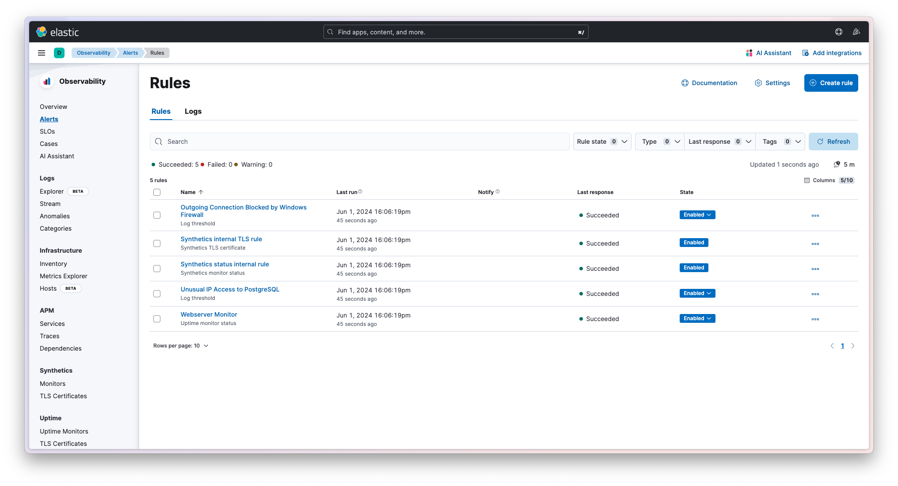

In this panel, we can see existing rules, as well as create a new rule. To create a new rule, click on the "Create rule" button. A panel similar to the following will be displayed:

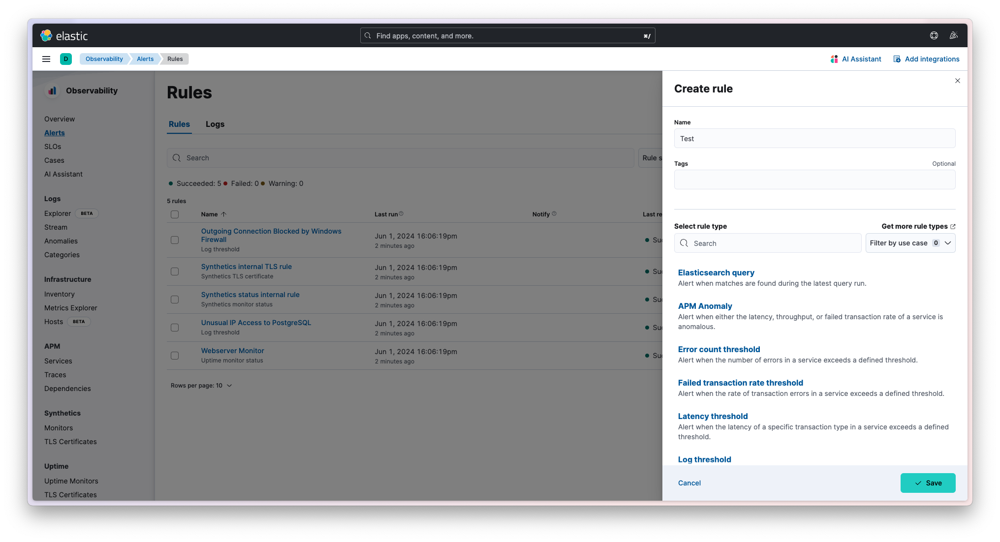

We can see that we need to choose a name and a rule type. There are many options here, and each option may have different configurations. Rules that trigger more interesting alerts are those of type "Anomaly Detection". Unfortunately, these functionalities are not available in the free version of Kibana. Therefore, we will see an example rule of type "Log Threshold".

When we select that rule type, a panel similar to the following will be displayed:

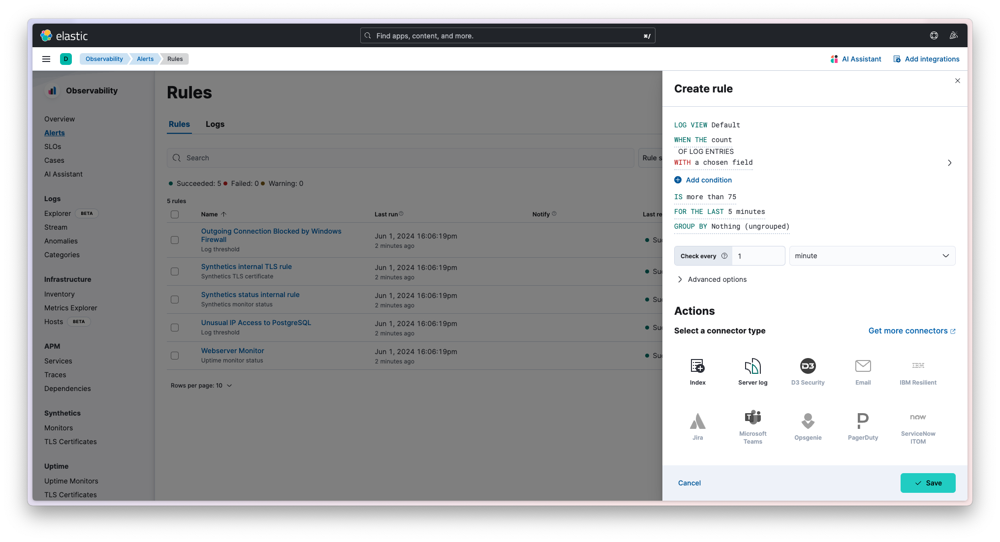

We see two important sections: "Define rule" and "Define action". In the first one, we define the condition that must be met for the rule to trigger. In the second one, we define the action that will be executed when the rule triggers. We see that there are many action options, such as sending an email, sending a message to a Slack channel, or executing a webhook. However, these functionalities are not available in the free version of Kibana; you can only add an entry to an Elasticsearch index or display the alert in the alert panel for free.

Once the rule is configured, click the "Save rule" button to save it.

If we click on the rule, we will see a detailed view of it. At the top, we can see a button that allows us to enable or disable the rule. At the bottom, we can see a button that allows us to view the alerts triggered by the rule. Also, we can see the summary of all rule executions, as seen in the following image:

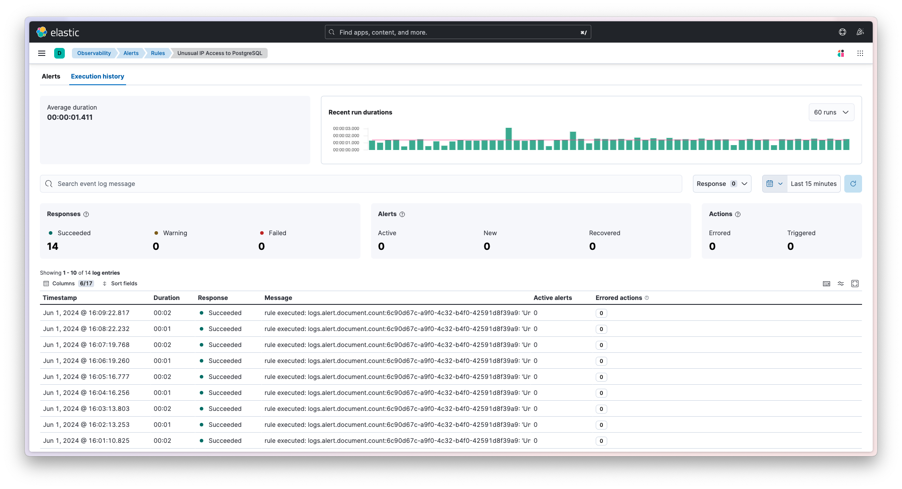

### Uptime Monitors

The **Uptime Monitors** option allows monitoring the availability of services and applications. Upon entering this section, we will see a screen similar to the following:

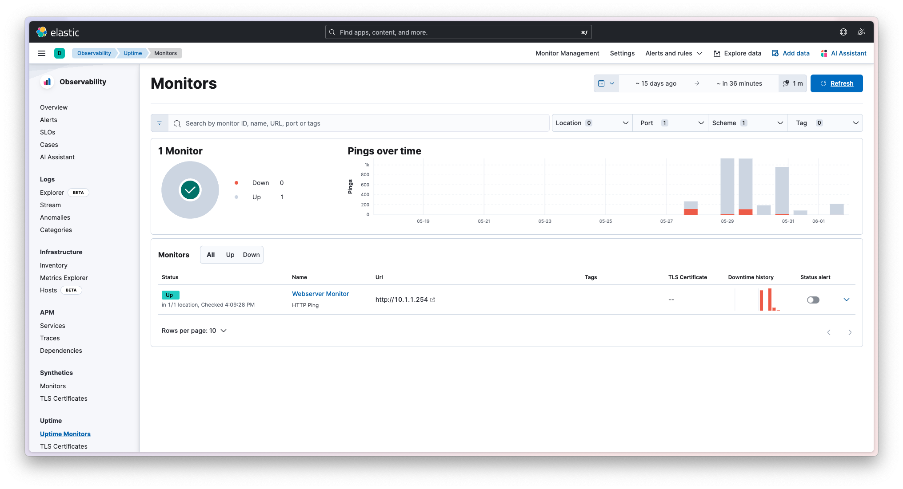

We can see a list of uptime monitors running, as well as a chart of the availability of services and applications over time.

Creating a new monitor is completely different from all other resources in Kibana. It is not created directly from the Kibana interface, but rather an configuration file is imported, after configuring the monitor using Heartbeat. For more information, see the tutorial [Monitoring a Service with Heartbeat](./monitoring-service-with-heartbeat.md).

## Management

This section focuses on Kibana's management functionalities. There are hundreds of configurations to adjust Kibana to the needs of each organization. The most important thing that can be managed are the Elasticsearch indices and Kibana objects, such as visualizations, dashboards, rules, monitors, etc.

Managing Elasticsearch indices is done in the **Index Management** section. Upon entering this section, we will see a screen similar to the following:

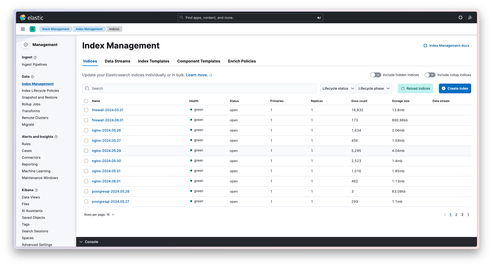

We can see a list of Elasticsearch indices, as well as information about them, such as size, number of documents, number of shards, etc. Here we can configure rollover rules, delete indices, and perform other maintenance tasks.

Managing Kibana objects is done in the **Saved Objects** section. Upon entering this section, we will see a screen similar to the following:

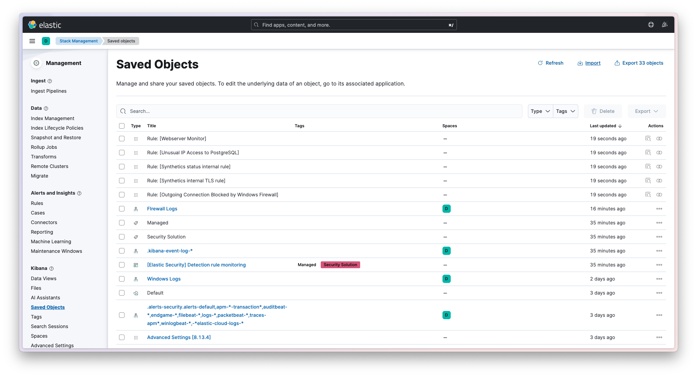

We can see a list of Kibana objects, such as visualizations, dashboards, rules, monitors, etc. Here we can import and export objects, as well as perform other maintenance tasks. This is where the configuration for monitors is imported.

Another important configuration section is roles and permissions. In the version used for this tutorial, this section is not present as the Elastic stack has not been configured with SSL certificates and general security. If it were, roles and permissions could be configured for Kibana users.
