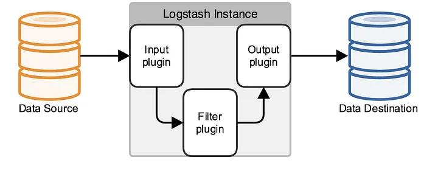

# Using Logstash on Ubuntu

## Prerequisites

Elastic's repository is not included in the default `apt` repository. Therefore, you need to install the repository first, and then install the required packages:

1. Import Elastic's PGP Key. This is the key used to sign all of its packages

    ```Bash
    wget -qO - https://artifacts.elastic.co/GPG-KEY-elasticsearch | sudo gpg --dearmor -o /usr/share/keyrings/elasticsearch-keyring.gpg
    ```
    
2. Install the `apt-transport-https` package

    ```Bash
    sudo apt install apt-transport-https
    ```
    
3. Install Elastic's repository

    ```Bash
    echo "deb [signed-by=/usr/share/keyrings/elasticsearch-keyring.gpg] https://artifacts.elastic.co/packages/8.x/apt stable main" | sudo tee /etc/apt/sources.list.d/elastic-8.x.list
    ```
    
4. Update `apt` records

    ```Bash
    sudo apt update
    ```

## Installing `logstash`

1. Install `logstash` from `apt`

    ```Bash
    sudo apt install logstash
    ```
    
2. Generate the log folder for `logstash`, to avoid issues later on

    ```Bash
    sudo mkdir /var/log/logstash
    sudo chown logstash:logstash /var/log/logstash
    sudo chmod u=rwx,g=rx+s,o= /var/log/logstash
    ```
    
3. Configure the `logstash` service to start on boot

    ```Bash
    systemctl enable logstash
    ```
    
4. Start the `logstash` service

    ```Bash
    systemctl start logstash
    ```

> [!NOTE]
> To test the functionality of a configuration file, you can run Logstash using the following command: `/usr/share/logstash/bin/logstash -f <path>`

## Logstash Configuration

The system configuration is located in `/etc/logstash`. By default, all files with the `.conf` extension stored in `/etc/logstash/conf.d` will be executed when the service starts.

Logstash works with *pipelines*. These consist of receiving data from an input, transforming it by applying filters, and finally depositing the result into an output. All of this is specified in a configuration file for each *pipeline*.



### Pipeline Structure

```
# This is a comment.

input {
  ...
}

filter {
  ...
}

output {
  ...
}
```

The file of a pipeline has three components: `input`, `filter`, and `output`. Their names are self-explanatory.

In each of the components, one or more plugins are configured to execute when receiving data. For example, if you wanted to obtain data from an HTTP connection, you would use the `http` plugin in the `input` component. On the other hand, if you wanted to save the data in an Elasticsearch database, you would use the `elasticsearch` plugin in the `output` component.

You can see a complete list of available plugins at the following URLs:

- To see the available plugins for the `input` component, click [here](https://www.elastic.co/guide/en/logstash/current/input-plugins.html).
- To see the available plugins for the `filter` component, click [here](https://www.elastic.co/guide/en/logstash/current/filter-plugins.html).
- To see the available plugins for the `output` component, click [here](https://www.elastic.co/guide/en/logstash/current/output-plugins.html).

### Example 1: NGINX Logs

> [!IMPORTANT]
> The Linux user `logstash` must have read permissions on the log file. Depending on the file being read, multiple alternatives achieve this: add the `logstash` user to the `adm` group, grant read permissions to that file specifically using `chmod`, among others.


```
# /etc/logstash/conf.d/example_1.conf

input {
	file {
		path => "/var/log/nginx/access.log"
	}
}

filter {
	grok {
		match => { "message" => "%{IPORHOST:remote_addr} - %{USERNAME:remote_user} \[%{HTTPDATE:time_local}\] \"%{DATA:request}\" %{INT:status} %{NUMBER:bytes_sent} \"%{DATA:http_referer}\" \"%{DATA:http_user_agent}\"" }
	}
	geoip {
		source => "[remote_addr]"
		target => "client"
	}
}

output {
	stdout { codec => rubydebug }
}
```

The `input` component has a single plugin from which it receives data. In this case, logs are read from the file `/var/log/nginx/access.log`.

The `filter` component, responsible for transforming the data, has two plugins:

- `grok`. It is used to parse unstructured log data into a structured object from which queries can be made. In this case, the NGINX log is transformed into an object with all the data separated into different fields.
- `geoip`. It is used to obtain data from an IP address. The IP from the `remote_addr` field will be taken, and the new information will be added to the `client` field.

Finally, the `output` component has a single plugin: `stdout`. The entire log content will be printed to the screen. To make it print in a more user-friendly manner, the `rubydebug` codec is used.

### Example 2: NGINX Logs Saved in Elasticsearch

> [!IMPORTANT]
> If Elasticsearch is configured with security enabled, you must follow the steps to obtain the SSL certificate and uncomment the commented lines in the following example. Additionally, you must assign the `ELK_USER` and `ELK_PWD` environment variables with the access credentials to Elasticsearch.

```
# /etc/logstash/conf.d/example_2.conf

input {
	file {
		path => "/var/log/nginx/access.log"
        type => "nginx"
	}
}

filter {
	grok {
		match => { "message" => "%{IPORHOST:remote_addr} - %{USERNAME:remote_user} \[%{HTTPDATE:time_local}\] \"%{DATA:request}\" %{INT:status} %{NUMBER:bytes_sent} \"%{DATA:http_referer}\" \"%{DATA:http_user_agent}\"" }
	}
	geoip {
		source => "[remote_addr]"
		target => "client"
	}
}

output {
	elasticsearch {
		hosts => ["https://localhost:9200"]
        index => "%{[type]}-%{+YYYY.MM.dd}"
		# cacert => "/etc/logstash/certs/http_ca.crt"
		# user => "${ELK_USER}"
		# password => "${ELK_PWD}"
	}
}
```

The only component that changed was `output`, where the `elasticsearch` plugin was added.

To use this plugin, certain parameters must be configured:

1. You must set the environment variables `ELK_USER` and `ELK_PWD` with the access keys to ELK; the ones used in the previous tutorial should work without issues.
2. Set the URL to the Elasticsearch cluster. In this case, `https://localhost:9200`.
3. If the Elasticsearch cluster is configured with security enabled, you must obtain the SSL certificate that Elasticsearch uses to sign its communications. This is a self-signed certificate created when Elasticsearch was first started. You need to obtain a copy. On the host running the Elasticsearch cluster, copy the file `/etc/elasticsearch/certs/http_ca.crt` to the host running Logstash. Then, proceed as follows:

    1. Assuming the certificate is located at `/tmp/http_ca.crt`.
    2. Create a directory where Logstash has access to store the certificate
        
        ```
        sudo -u logstash mkdir /etc/logstash/certs
        ```
        
    3. Move the certificate to this directory and assign the appropriate permissions
        
        ```
        sudo mv /tmp/http_ca.crt /etc/logstash/certs/http_ca.crt
        sudo chown logstash:logstash /etc/logstash/certs/http_ca.crt
        ```
        
    4. Done!
4. As a best practice, the `type` field is used to assign a type to the logs. In this case, it is assigned the value `nginx`. Then, in the `index` field of the output, the `type` value is used to assign the index in which the logs will be stored. For example, if the log type is `nginx`, it will be stored in the `nginx-YYYY.MM.dd` index, where `YYYY.MM.dd` is the date the log was saved. This allows for a more organized structure in Elasticsearch and facilitates log searching in Kibana.

With this configured, you should now see the logs in Kibana by accessing Observability > Logs > Stream.

> [!TIP]
> All pipelines used in the examples are located in the repository under the directory `/files/logstash`.

## Grok

Grok is a Logstash plugin that allows parsing unstructured logs into a structured object. To use it, patterns that match the logs to be parsed must be defined.

These patterns map specific parts of the line to dedicated fields, and actions can be performed based on this mapping.

The syntax of a pattern is as follows: `%{TYPE:variable}`. This way, the value of the part of the line that matches `TYPE` is assigned to the `variable` field.

Let's see an example:

```text
%{IPORHOST:remote_addr} \[%{HTTPDATE:time_local}\] \"%{DATA:http_verb} %{DATA:http_resource} %{DATA:http_version}\" %{INT:status} %{NUMBER:bytes_sent} \"%{DATA:http_referer}\" \"%{DATA:http_user_agent}\"
```

This pattern matches with the following line:

```text
181.117.76.4 [27/May/2024:19:10:32 +0000] "GET / HTTP/1.1" 304 0 "-" "Mozilla/5.0 (Macintosh)"
```

And this JSON will be generated:

```json
{
    "remote_addr": "181.117.76.4",
    "time_local": "27/May/2024:19:10:32 +0000",
    "http_verb": "GET",
    "http_resource": "/",
    "http_version": "HTTP/1.1",
    "status": 304,
    "bytes_sent": 0,
    "http_referer": "-",
    "http_user_agent": "Mozilla/5.0 (Macintosh"
}
```

A good website to test Grok patterns is [Grok Debugger](https://grokdebugger.com/).