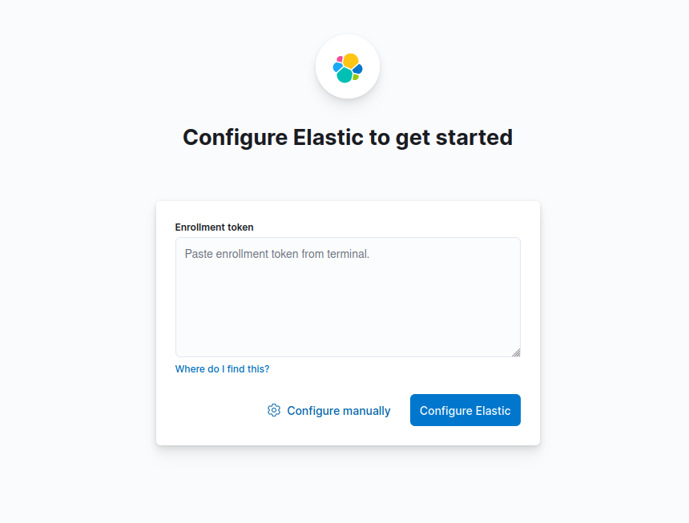

# Instalar Elasticsearch y Kibana en Linux

## Prerrequisitos

El repositorio de Elastic no se encuentra incorporado en el repository default de `apt`. Por eso, hay que instalar el repositorio primero, para luego instalar los paquetes requeridos:

1. Importamos la PGP Key de Elastic. Es la clave utilizada para firmar todos sus paquetes
    
    ```Bash
    wget -qO - https://artifacts.elastic.co/GPG-KEY-elasticsearch | sudo gpg --dearmor -o /usr/share/keyrings/elasticsearch-keyring.gpg
    ```
    
2. Instalamos el paquete `apt-transport-https`
    
    ```Bash
    sudo apt install apt-transport-https
    ```
    
3. Instalamos el repositorio de Elastic
    
    ```Bash
    echo "deb [signed-by=/usr/share/keyrings/elasticsearch-keyring.gpg] https://artifacts.elastic.co/packages/8.x/apt stable main" | sudo tee /etc/apt/sources.list.d/elastic-8.x.list
    ```
    
4. Actualizamos los registros de `apt`
    
    ```Bash
    sudo apt update
    ```
    

## Instalando `elasticsearch`

Ahora si, estamos listos para instalar los componentes de Elastic Stack:

1. Instalamos `elasticsearch` desde `apt`
    
    ```Bash
    sudo apt install elasticsearch
    ```
    
2. Configuramos el servicio de `elasticsearch` para que se inicie cuando se inicia la máquina
    
    ```Bash
    systemctl enable elasticsearch
    ```
    
3. Iniciamos el servicio de `elasticsearch`
    
    ```Bash
    systemctl start elasticsearch
    ```

4. Para correr el servicio como un cluster, debemos editar el archivo de configuración `/etc/elasticsearch/elasticsearch.yml`
    
    El archivo comienza así:
    
    ```yaml
    # ======================== Elasticsearch Configuration =========================
    #
    # NOTE: Elasticsearch comes with reasonable defaults for most settings.
    #       Before you set out to tweak and tune the configuration, make sure you
    #       understand what are you trying to accomplish and the consequences.
    #
    # The primary way of configuring a node is via this file...
    ```
    
    Para la configuración del cluster, supongamos que las IPs de los nodos son `10.1.102.178` y `10.1.103.227`
    
    Se deben sobrescribir el archivo con el siguiente:
    
    ```yaml
    path.data: /var/lib/elasticsearch
    path.logs: /var/log/elasticsearch

    xpack.security.enabled: false
    xpack.security.enrollment.enabled: true
    http.host: 0.0.0.0

    # Desactivar configuración SSL
    xpack.security.transport.ssl.enabled: false
    xpack.security.http.ssl.enabled: false

    # Los nodos pueden actuar como nodo master, como nodo de información y como nodo de ingesta de infromación
    node.roles: [master, data, ingest]
    node.name: ip-10-1-103-227

    # Con esta opción se desactiva el swapping para mejorar la performance (asignándole true). En hosts con poca memoria, se deja activado.
    bootstrap.memory_lock: false

    # Loopback y la dirección IP privada del nodo actual
    network.host: [127.0.0.1, 10.1.103.227]

    cluster.name: elk_cluster

    # Todos los node names que son elegibles como master nodes
    cluster.initial_master_nodes: ["ip-10-1-102-178", "ip-10-1-103-227"]
    # Todas las IPs de los nodos
    discovery.seed_hosts: ["10.1.102.178", "10.1.103.227"]
    ```

    Se puede acceder al archivo YAML de configuración utilizado en este ejemplo en `/files/linux/elasticsearch.yml` en este repositorio.
    

## Instalando `kibana`

1. Instalamos `kibana` desde `apt`
    
    ```
    sudo apt install kibana
    ```
    
2. Configuramos el servicio de `kibana` para que se inicie cuando se inicia la máquina
    
    ```Bash
    systemctl enable kibana
    ```
    
3. Iniciamos el servicio de `kibana`
    
    ```Bash
    systemctl start kibana
    ```
    

## Configurando el panel de Kibana

> [!NOTE]  
> Se debería usar Nginx o cualquier proxy reverso para exponer el panel de Kibana, que corre en el puerto `5601`. Para el ejemplo, supongamos que se expone el panel a través del URL `kibana.example.com`

1. Ingresamos a `http://kibana.example.com`. Veremos la siguiente página de configuración:
    
    
    
    Se puede configurar Kibana a través de un Enrollment Token o a través de un usuario y contraseña. Su uso dependerá de qué tanto control queremos tener en la configuración. Además, es recomendado usar el Enrollment Token si Kibana y Elasticsearch no están corriendo en el mismo host. En nuestro caso, iremos por la configuración manual.
    
2. Clickeamos en el botón “Configure manually”. Veremos la siguiente página:
    
    
    
3. Clickeamos en “Check address” para que Kibana intente conectarse a Elasticsearch. Veremos la siguiente pantalla:
    
    
    
    Este modal aparecerá solo si Elasticsearch tiene las funciones de seguridad habilitadas. En caso de que no estén habilitadas, se podrá acceder a Kibana sin problemas, sin necesidad de crear ningún usuario. Sólo se deberá validar el acceso al servidor donde está alojado como se explica en el paso 5.
    
4. Obtenemos la contraseña del usuario `kibana_system` ejecutando:
    
    ```Bash
    sudo /usr/share/elasticsearch/bin/elasticsearch-reset-password --username kibana_system
    ```
    
    Una vez que la obtenemos, la pegamos en su campo correspondiente y clickeamos en “Configure Elastic”
    
5. Se nos preguntará por un código de verificación, que obtendremos con el siguiente comando:
    
    
    
    ```Bash
    sudo /usr/share/kibana/bin/kibana-verification-code
    ```
    
6. Luego de esperar que se apliquen todas las configuraciones, se nos pedirá que iniciemos sesión. Para eso, requerimos un usuario.
    
    ```Bash
    sudo /usr/share/elasticsearch/bin/elasticsearch-users useradd johndoe -r superuser
    ```
    
    Recomendamos generar la contraseña utilizando el siguiente comando: `pwgen -cnsy -N 1`
    
7. Con este usuario, podremos ingresar al dashboard de Elastic.

### Roles y permisos

> [!IMPORTANT]  
> Estas configuraciones sólo estarán disponibles si el cluster de Elasticsearch se ha configurado con seguridad habilitada. En caso contrario, con sólo obtener el URL del panel de Kibana, se podrá acceder sin problemas.

Desde una cuenta con permisos de superuser, podremos crear nuevos roles, crear usuarios y crear espacios de trabajo para dichos usuarios. Para configurar todo esto:

1. Abrir el menú lateral izquierdo
2. Clickear Management > Stack Management
3. Dentro del grupo Security, clickear en Roles

Allí se podrá especificar todos los permisos para cada sección de Kibana y su integración con Elasticsearch.

Luego, se puede crear un usuario clickeando, dentro del grupo Security, el botón Users. Se le debe asignar un rol de los built-in o de los personalizados que hayamos creado anteriormente.