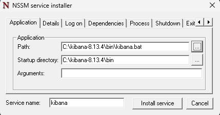
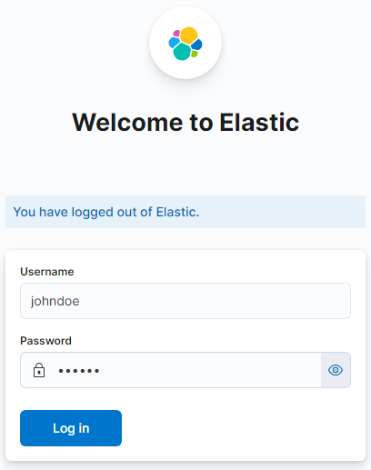

# Instalar ELK in Windows

En este documento veremos como instalar y correr como servicio a `elasticsearch` y a `kibana`.

> [!NOTE]
> En ambos casos estaremos trabajando en la carpeta `C:\program-version-number`.

> [!IMPORTANT]  
> Para nuestra configuración en AWS solamente se necesitaron los apartados presentes en el documento llamado `using-logstash-in-windows.md`. Las configuraciones para `elasticsearch` y `kibana` fueron realizadas en instancias EC2 Ubuntu y por eso en este documento solamente se muestra la configuración de los mismos en el ambiente local.

## Instalando `elasticsearch`

1. Descargamos `elasticsearch` de la página:
    
    [Install Elasticsearch with .zip on Windows | Elasticsearch Guide [8.13] | Elastic](https://www.elastic.co/guide/en/elasticsearch/reference/8.13/zip-windows.html)
    
2. Descomprimimos el archivo `.zip` que descargamos e ingresamos en la carpeta correspondiente. En nuestro caso ingresaremos a `C:\elasticsearch-8.13.4`.
3. Abirmos una terminal como administradores e ingresamos a la carpeta `C:\elasticsearch-8.13.4\bin`. Corremos en la terminal el archivo `.\elasticsearch.bat` para poder crear el servicio:
    
    ```bash
    C:\elasticsearch-8.13.4\bin> .\elasticsearch-service.bat install
    ```
    > [!NOTE]  
    > Si no funciona con Command Prompt, probar con Windows PowerShell. No olvidarse de abrirlo como administrador.

4. En esa misma terminal corremos el siguiente comando para poder iniciar el servicio en Windows.
    ```bash
    C:\elasticsearch-8.13.4\bin> .\elasticsearch-service.bat start
    ```
    > [!NOTE]  
    > Si no funciona con Command Prompt, probar con Windows PowerShell. No olvidarse de abrirlo como administrador.

5. Abrimos otra terminal también como administradores, ingresamos a la carpeta `C:\elasticsearch-8.13.4\bin` y corremos el siguiente comando:
    
    ```bash
    C:\elasticsearch-8.13.4\bin> .\elasticsearch-users useradd johndoe -r superuser
    ```
    
    Esto permite crear un nuevo usuario con el nombre `johndoe` y nos solicitará que ingresemos una contraseña. Esto nos permitirá ingresar posteriormente a `kibana`. Como ejemplo, escogimos los siguientes datos de ingreso:
    
    - User: `johndoe`
    - Password: `123456`

## Instalando `kibana`

1. Descargamos `kibana` de la página:
    
    [Install Kibana on Windows | Kibana Guide [8.13] | Elastic](https://www.elastic.co/guide/en/kibana/current/windows.html#windows-enroll)
    
2. Descomprimimos el archivo `.zip` que nos descargo y después ingresamos a la carpeta `C:\kibana-8.13.4`
3. Antes de continuar con `kibana` debemos ir a la carpeta donde se encuentra el archivo `elasticsearch-reset-password.bat` (en nuestro caso se encuentra en `C:\elasticsearch-8.13.4\bin\elasticsearch-reset-password.bat`) y abrimos una terminal como administrador para correr el siguiente comando:
    
    ```bash
    >> cd elasticsearch-8.13.4\bin
    >> .\elasticsearch-reset-password.bat -u kibana_system --auto
    warning: ignoring JAVA_HOME=C:\Users\nehue\.jdks\openjdk-20.0.2; using bundled JDK
    This tool will reset the password of the [kibana_system] user to an autogenerated value.
    The password will be printed in the console.
    Please confirm that you would like to continue [y/N]y
    
    Password for the [kibana_system] user successfully reset.
    New value: 6=ODDsGRMseRebDp1W2F
    ```
    
    Obtendremos la contraseña del usuario `kibana_system` que nos ayudará más adelante.
    
4. Ingresamos al archivo `kibana.yml`presente en la carpeta `C:\elasticsearch-8.13.4\config`. Una vez en él, lo completaremos agregando las siguientes líneas:
    
    ```bash
    # =================== System: Elasticsearch ===================
    # The URLs of the Elasticsearch instances to use for all your queries.
    elasticsearch.hosts: ["http://localhost:9200"]

    # If your Elasticsearch is protected with basic authentication, these settings provide
    # the username and password that the Kibana server uses to perform maintenance on the Kibana
    # index at startup. Your Kibana users still need to authenticate with Elasticsearch, which
    # is proxied through the Kibana server.
    elasticsearch.username: "kibana_system"
    elasticsearch.password: "6=ODDsGRMseRebDp1W2F"
    ```
 
5. Descargamos NSSM de la página:
    
    [NSSM - the Non-Sucking Service Manager](https://nssm.cc/download)
    
6. Extraemos el archivo `nssm.exe` de la carpeta  `nssm-<version>\win64\nssm.exe` y lo ubicamos en `C:\kibana-8.13.4\`.
7. Abrimos una terminal como administradores en la carpeta `C:\kibana-8.13.4\` y corremos el siguiente comando:
   
    ```bash
    C:\kibana-8.13.4> .\bin\nssm.exe install kibana
    ```
8. Corriendo el comando anterior aparece una ventana de `NSSM service installer`. En ella debemos especificar los siguientes parámetros:
    - Path (path a `kibana.bat`): `C:\kibana-8.13.4\bin\kibana.bat`.
    - Startup Directory (path al directorio `bin`): `C:\kibana-8.13.4\bin`.
    - Arguments: lo dejamos vacío.
  
    
        
    
    Le damos a **Install service** para que se cree el servicio.

9. Abrimos una terminal como administradores y corremos el servicio que creamos previamente:
    
    ```text
    C:\kibana-8.13.4> Start-Service Kibana
    ```

10. Ingresamos a [localhost:5601](https://localhost:5601) y nos solicita iniciar sesión. Para ello completamos con los siguientes datos de superusuario creados previamente:
    - User: `johndoe`
    - Password: `123456`
    
    
11. Una vez dentro podremos ver el menú de `kibana` y estamos listos para explorar todas sus funcionalidades:
    