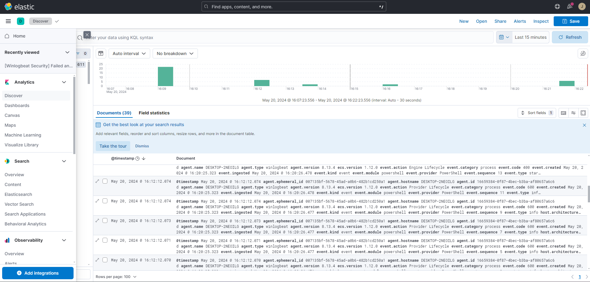
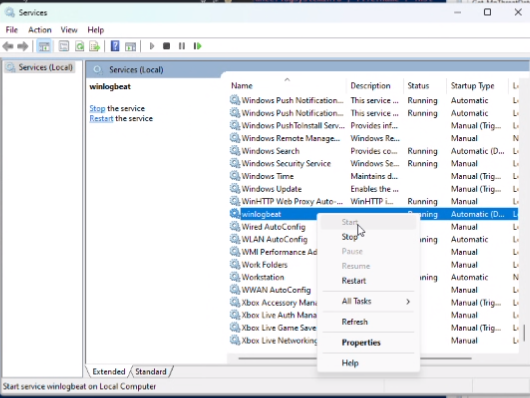
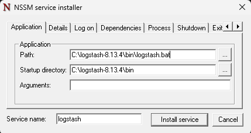
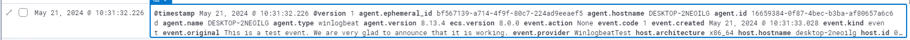

# Instalar ELK in Windows

<aside>

**REVISAR ESTO:**

**API integration key required:**
**A new encryption key is generated for saved objects each time you start Kibana. Without a persistent key, you cannot delete or modify rules after Kibana restarts. To set a persistent key, add the xpack.encryptedSavedObjects.encryptionKey setting with any text value of 32 or more characters to the kibana.yml file.**

</aside>

# 0. Eventos de Windows con ELK

Existen varias maneras de obtener los logs de Windows con ELK. En ambas aparece un nuevo partícipe del stack de Elastic que se denomina Winlogbeat. A continuación, podemos ver las tecnolías a usar para cada manera:

- Winlogbeat + Elasticsearch + Kibana = Winlogbeat + EK
- Winlogbeat + Logstash + Elasticsearch + Kibana = Winlogbeat + ELK
- Winlogbeat + Logstash + Elasticsearch + Kibana = Winlogbeat + ELK (Logstash as a service)

En todo momento estaremos trabajando en la carpeta: **`C:\program-version-number`**.
La siguiente sección es común para las tres.

## 0.1. Instalando Elasticsearch

1. Descargamos Elasticsearch de la página:
    
    [Install Elasticsearch with .zip on Windows | Elasticsearch Guide [8.13] | Elastic](https://www.elastic.co/guide/en/elasticsearch/reference/8.13/zip-windows.html)
    
2. Nos descarga un .zip asi que tenemos que descomprimir y después ingresar a la carpeta de **`C:\elasticsearch-8.13.4`**
3. Tendremos varias carpetas dentro de **`elasticsearch-8.13.4`** y solamente nos interesa ingresar a **`C:\elasticsearch-8.13.4\bin`**.
    
    ```bash
    >> cd bin
    ```
    
4. Corremos en la terminal el comando para poder instalarlo:
    
    ```bash
    >> .\elasticsearch.bat
    ```
    
5. Abrimos otra terminal y corremos esto también en la carpeta **`C:\elasticsearch-8.13.4\bin`**:
    
    ```bash
    >> .\elasticsearch-users useradd johndoe -r superuser
    ```
    
    Esto crea un nuevo usuario y contraseña y es lo que nos permitirá ingresar a Kibana más adelante con los siguientes datos:
    
    - User: **`johndoe`**
    - Password: **`123456`**

## 0.2. Instalando Kibana

1. Descargamos Kibana de la página:
    
    [Install Kibana on Windows | Kibana Guide [8.13] | Elastic](https://www.elastic.co/guide/en/kibana/current/windows.html#windows-enroll)
    
2. Nos descarga un .zip asi que tenemos que descomprimirlo y después ingresar a la carpeta de **`C:\kiabana-8.13.4`**
3. Antes de continuar con Kibana debemos ir a la carpeta donde se encuentra el archivo **`elasticsearch-reset-password.bat`** (en nuestro caso se encuentra en **`C:\elasticsearch-8.13.4\bin\elasticsearch-reset-password.bat`**) y abrimos una terminal para correr lo siguiente:
    
    ```bash
    >> cd elasticsearch-8.13.4\bin
    >> .\elasticsearch-reset-password.bat -u kibana_system --auto
    warning: ignoring JAVA_HOME=C:\Users\nehue\.jdks\openjdk-20.0.2; using bundled JDK
    This tool will reset the password of the [kibana_system] user to an autogenerated value.
    The password will be printed in the console.
    Please confirm that you would like to continue [y/N]y
    
    Password for the [kibana_system] user successfully reset.
    New value: 6=ODDsGRMseRebDp1W2F
    ```
    
    Obtendremos la contraseña del usuario **`kibana_system`** que nos ayudará más adelante.
    
4. Debemos cambiar el archivo .yaml de configuración descomentando las líneas del **`elasticsearch.username`** y **`elasticsearch.password`**:
    
    ```bash
    # If your Elasticsearch is protected with basic authentication, these settings provide
    # the username and password that the Kibana server uses to perform maintenance on the Kibana
    # index at startup. Your Kibana users still need to authenticate with Elasticsearch, which
    # is proxied through the Kibana server.
    elasticsearch.username: "kibana_system"
    elasticsearch.password: "6=ODDsGRMseRebDp1W2F"
    ```
    
5. Corremos en la terminal el comando para poder instalarlo en la carpeta donde se encuentra Kibana (**`C:\kiabana-8.13.4`**):
    
    ```bash
    >> .\bin\kibana.bat
    ```
    
6. Ingresamos a [localhost:5601](https://localhost:5601) e ingresamos con el siguiente usuario y contraseña:
    - User: **`johndoe`**
    - Password: **`123456`**

# 1. Winlogbeat + EK

El proceso consta de tres etapas:

1. Instalar Elasticsearch.
2. Instalar Kibana.
3. Instalar y configurar Winlogbeat.

[Analyse Windows Event Logs In ELK SIEM | Security SIEM Detection Lab Setup Tutorial #3](https://www.youtube.com/watch?v=gC3g8bLkhYg)

<aside>

**Para hacer esto ya tiene que estar corriendo Elasticsearch y Kibana.**

</aside>

1. Descargamos de la página el **`.zip`** de Winlogbeat
    
    [Winlogbeat quick start: installation and configuration | Winlogbeat Reference [8.13] | Elastic](https://www.elastic.co/guide/en/beats/winlogbeat/current/winlogbeat-installation-configuration.html)
    
2. Descomprimimos la carpeta y al igual que en los otros dos casos lo ubicamos en la carpeta del disco correspondiente.
3. Abrimos powershell como administrador nos ubicamos en la carpeta de winlogbeat **`C:\winlogbeat`** y corremos **`.\install-service-winlogbeat.ps1`**
    
    ```bash
    C:\winlogbeat> .\install-service-winlogbeat.ps1
    Security warning
    Run only scripts that you trust. While scripts from the internet can be useful,
    this script can potentially harm your computer. If you trust this script, use
    the Unblock-File cmdlet to allow the script to run without this warning message.
    Do you want to run C:\Program Files\Winlogbeat\install-service-winlogbeat.ps1?
    [D] Do not run  [R] Run once  [S] Suspend  [?] Help (default is "D"): R
    
    Status   Name               DisplayName
    ------   ----               -----------
    Stopped  winlogbeat         winlogbeat
    ```
    
    Si no funciona intenta esto:
    
    ```bash
    C:\winlogbeat> powershell -ExecutionPolicy Bypass -File .\install-service-winlogbeat.ps1
    ```
    
4. Configuramos a Winlogbeat para que pueda conectarse con EK en el archivo **`winlogbeat.yml`** que se encuentra en **`C:\winlogbeat`**:
    
    <aside>
    
    **Leer en el siguiente link las configuraciones para poder obtener logs de diferentes tipos. Con la configuración actual solamente obtendremos los logs de aplicaciones y los de seguridad.**
    
    [Configure Winlogbeat | Winlogbeat Reference [8.13] | Elastic](https://www.elastic.co/guide/en/beats/winlogbeat/current/configuration-winlogbeat-options.html)
    
    </aside>
    
    En el apartado de Kibana debemos descomentar para que quede lo siguiente:
    
    ```bash
    # =================================== Kibana ===================================
    
    # Starting with Beats version 6.0.0, the dashboards are loaded via the Kibana API.
    # This requires a Kibana endpoint configuration.
    setup.kibana:
    
      # Kibana Host
      # Scheme and port can be left out and will be set to the default (http and 5601)
      # In case you specify and additional path, the scheme is required: http://localhost:5601/path
      # IPv6 addresses should always be defined as: https://[2001:db8::1]:5601
      host: "localhost:5601"
    
      # Kibana Space ID
      # ID of the Kibana Space into which the dashboards should be loaded. By default,
      # the Default Space will be used.
      #space.id:
    ```
    
    En el apartado de Elasticsearch debemos descomentar para que quede lo siguiente:
    
    ```bash
    # ================================== Outputs ===================================
    
    # Configure what output to use when sending the data collected by the beat.
    
    # ---------------------------- Elasticsearch Output ----------------------------
    output.elasticsearch:
      # Array of hosts to connect to.
      hosts: ["localhost:9200"]
    
      # Protocol - either `http` (default) or `https`.
      #protocol: "https"
    
      # Authentication credentials - either API key or username/password.
      #api_key: "id:api_key"
      username: "johndoe"
      password: "123456"
    
      # Pipeline to route events to security, sysmon, or powershell pipelines.
      pipeline: "winlogbeat-%{[agent.version]}-routing"
    ```
    
    **El apartado de Logstash queda comentado porque en este caso no lo usaremos.**
    
    
    En el apartado de Logging debemos agregar esas líneas para crear archivos de logs en la carpeta definida:
    
    ```bash
    # ================================== Logging ===================================
    
    # Sets log level. The default log level is info.
    # Available log levels are: error, warning, info, debug
    #logging.level: debug
    
    # At debug level, you can selectively enable logging only for some components.
    # To enable all selectors, use ["*"]. Examples of other selectors are "beat",
    # "publisher", "service".
    #logging.selectors: ["*"]
    logging.to_files: true
    logging.files:
      path: C:\winlogbeat\Logs
    logging.level: info
    ```
    
    El archivo completa a continuación:
    
    [winlogbeat.yml](Instalar%20ELK%20in%20Windows%20432e25e8516c4d86ad8c49269fc3c1f9/winlogbeat.yml)
    
5. Corremos el siguiente comando para testear que el archivo de configuración este todo ok:
    
    ```bash
    C:\winlogbeat>.\winlogbeat.exe test config -c .\winlogbeat.yml -e
    ```
    
6. Configuramos los assets:
    
    ```bash
    C:\winlogbeat>.\winlogbeat.exe setup -e
    ```
    
    Esto te tiene que tirar mensajes como:
    
    ```bash
    C:\winlogbeat>.\winlogbeat.exe setup -e
    ...
    Overwriting lifecycle policy is disabled. Set `setup.ilm.overwrite: true` to overwrite.
    ...
    Index setup finished.
    Loading dashboards (Kibana must be running and reachable)
    ...
    Loaded dashboards
    ..
    Loaded Ingest pipelines
    C:\winlogbeat>
    ```
    
7. Logueate en Kibana con el usuario y contraseña correspondiente y podrás ver los logs.


# 2. Winlogbeat + ELK

1. Descargamos Logstash como hicimos con Elasticsearch y Kibana.
    
    [Download Logstash Free | Get Started Now](https://www.elastic.co/downloads/logstash)
    
2. Descomprimimos el archivo y lo ubicamos en **`C:\`**. 
3. Primero configuraremos el archivo **`logstash.yml`** que se encuentra ubicado en **`C:\logstash-8.13.4\config\`**:
    
    ```bash
    path.data: C:/logstash-8.13.4/data
    pipeline.workers: 2
    pipeline.batch.size: 125
    config.reload.automatic: true
    http.host: "127.0.0.1"
    http.port: 9600-9700
    ```
    
    Todo el resto del archivo está comentado y lo dejamos a continuación: [logstash.yml](../files/logstash.yml)
    
4. Ahora configuramos el archivo de configuración del pipeline **`logstash-sample.conf`** que se encuentra en **`C:\logstash-8.13.4\config\`**:
    
    <aside>
    
    **Una pipeline de Logstash es una secuencia de etapas sobre la cual los datos se transportan. Estas tiene tres etapas: input, filtro y output.**
    
    </aside>
    
    ```bash
        # Sample Logstash configuration for creating a simple
        # Beats -> Logstash -> Elasticsearch pipeline.

        input {
        beats {
            port => 5044
        }
        }

        filter {
        if [event_data] {
            mutate {
            rename => { "[event_data][param1]" => "message" }
            }
        }
        date {
            match => [ "timestamp" , "dd/MMM/yyyy:HH:mm:ss Z" ]
        }
        }

        output {
            if [@metadata][pipeline] {
            elasticsearch {
                hosts => ["http://localhost:9200"]
                manage_template => false
                index => "%{[@metadata][beat]}-%{[@metadata][version]}" 
                action => "create" 
                pipeline => "%{[@metadata][pipeline]}" 
                user => "johndoe"
                password => "123456"   
            }
            } else {
            elasticsearch {
                hosts => ["http://localhost:9200"]
                manage_template => false
                index => "%{[@metadata][beat]}-%{[@metadata][version]}" 
                action => "create"
                user => "johndoe"
                password => "123456" 
            }
            }
        }
    ```
    
    Veamos que configuramos el input y el output. Extraemos la data, en este caso de **`Winlogbeat`** y se la damos a **`Elasticsearch`**. Fijemosnos que le pasamos el usuario y también la contraseña del mismo para que la muestre en **`Kibana`** para ese user:password en específico.
    
5. Validamos el archivo de configuración del pipeline en la terminal corriendo:
    
    ```bash
    C:\logstash-8.13.4>.\bin\logstash.bat -t -f C:\logstash-8.13.4\config\logstash-sample.conf
    ```
    
    Nos tiene que devolver lo siguiente, específicamente con el Configuration OK:
    
    ```bash
    "Using bundled JDK: C:\logstash-8.13.4\jdk\bin\java.exe"
    C:/logstash-8.13.4/vendor/bundle/jruby/3.1.0/gems/concurrent-ruby-1.1.9/lib/concurrent-ruby/concurrent/executor/java_thread_pool_executor.rb:13: warning: method redefined; discarding old to_int
    C:/logstash-8.13.4/vendor/bundle/jruby/3.1.0/gems/concurrent-ruby-1.1.9/lib/concurrent-ruby/concurrent/executor/java_thread_pool_executor.rb:13: warning: method redefined; discarding old to_f
    Sending Logstash logs to C:/logstash-8.13.4/logs which is now configured via log4j2.properties
    [2024-05-20T18:39:13,637][INFO ][logstash.runner          ] Log4j configuration path used is: C:\logstash-8.13.4\config\log4j2.properties
    [2024-05-20T18:39:13,638][WARN ][logstash.runner          ] The use of JAVA_HOME has been deprecated. Logstash 8.0 and later ignores JAVA_HOME and uses the bundled JDK. Running Logstash with the bundled JDK is recommended. The bundled JDK has been verified to work with each specific version of Logstash, and generally provides best performance and reliability. If you have compelling reasons for using your own JDK (organizational-specific compliance requirements, for example), you can configure LS_JAVA_HOME to use that version instead.
    [2024-05-20T18:39:13,639][INFO ][logstash.runner          ] Starting Logstash {"logstash.version"=>"8.13.4", "jruby.version"=>"jruby 9.4.5.0 (3.1.4) 2023-11-02 1abae2700f OpenJDK 64-Bit Server VM 17.0.11+9 on 17.0.11+9 +indy +jit [x86_64-mswin32]"}
    [2024-05-20T18:39:13,640][INFO ][logstash.runner          ] JVM bootstrap flags: [-Xms1g, -Xmx1g, -Djava.awt.headless=true, -Dfile.encoding=UTF-8, -Djruby.compile.invokedynamic=true, -XX:+HeapDumpOnOutOfMemoryError, -Djava.security.egd=file:/dev/urandom, -Dlog4j2.isThreadContextMapInheritable=true, -Dlogstash.jackson.stream-read-constraints.max-string-length=200000000, -Dlogstash.jackson.stream-read-constraints.max-number-length=10000, -Djruby.regexp.interruptible=true, -Djdk.io.File.enableADS=true, --add-exports=jdk.compiler/com.sun.tools.javac.api=ALL-UNNAMED, --add-exports=jdk.compiler/com.sun.tools.javac.file=ALL-UNNAMED, --add-exports=jdk.compiler/com.sun.tools.javac.parser=ALL-UNNAMED, --add-exports=jdk.compiler/com.sun.tools.javac.tree=ALL-UNNAMED, --add-exports=jdk.compiler/com.sun.tools.javac.util=ALL-UNNAMED, --add-opens=java.base/java.security=ALL-UNNAMED, --add-opens=java.base/java.io=ALL-UNNAMED, --add-opens=java.base/java.nio.channels=ALL-UNNAMED, --add-opens=java.base/sun.nio.ch=ALL-UNNAMED, --add-opens=java.management/sun.management=ALL-UNNAMED, -Dio.netty.allocator.maxOrder=11]
    [2024-05-20T18:39:13,643][INFO ][logstash.runner          ] Jackson default value override logstash.jackson.stream-read-constraints.max-string-length configured to 200000000
    [2024-05-20T18:39:13,643][INFO ][logstash.runner          ] Jackson default value override logstash.jackson.stream-read-constraints.max-number-length configured to 10000
    [2024-05-20T18:39:13,673][WARN ][logstash.config.source.multilocal] Ignoring the 'pipelines.yml' file because modules or command line options are specified
    [2024-05-20T18:39:13,973][INFO ][org.reflections.Reflections] Reflections took 82 ms to scan 1 urls, producing 132 keys and 468 values
    [2024-05-20T18:39:14,818][INFO ][logstash.javapipeline    ] Pipeline main is configured with pipeline.ecs_compatibility: v8 setting. All plugins in this pipeline will default to ecs_compatibility => v8 unless explicitly configured otherwise.
    Configuration OK
    [2024-05-20T18:39:14,819][INFO ][logstash.runner          ] Using config.test_and_exit mode. Config Validation Result: OK. Exiting Logstash
    ```
    
6. Una vez que la configuración dio OK, entonces corremos el siguiente comando para correr a mi amigo **`Logstash`**:
    
    ```bash
    C:\logstash-8.13.4>.\bin\logstash.bat -f C:\logstash-8.13.4\config\logstash-sample.conf
    ```
    
7. Ahora vamos con el **`Winlogbeat`**. Debemos cambiar el archivo de configuración del mismo que es **`winlogbeat.yml`**. Comentaremos el apartado de Elasticsearch y modificaremos el de Logstash para enviar los logs allí:
    
    ```bash
    # =================================== Kibana ===================================
    
    # Starting with Beats version 6.0.0, the dashboards are loaded via the Kibana API.
    # This requires a Kibana endpoint configuration.
    setup.kibana:
    
      # Kibana Host
      # Scheme and port can be left out and will be set to the default (http and 5601)
      # In case you specify and additional path, the scheme is required:
      http://localhost:5601/path
      # IPv6 addresses should always be defined as: https://[2001:db8::1]:5601
      host: "localhost:5601"
    
      # Kibana Space ID
      # ID of the Kibana Space into which the dashboards should be loaded. By default,
      # the Default Space will be used.
      #space.id:
      ...
    # ================================== Outputs ===================================
    
    # Configure what output to use when sending the data collected by the beat.
    
    # ---------------------------- Elasticsearch Output ----------------------------
    # output.elasticsearch:
      # Array of hosts to connect to.
      # hosts: ["localhost:9200"]
    
      # Protocol - either `http` (default) or `https`.
      #protocol: "https"
    
      # Authentication credentials - either API key or username/password.
      #api_key: "id:api_key"
      # username: "johndoe"
      # password: "123456"
    
      # Pipeline to route events to security, sysmon, or powershell pipelines.
      # pipeline: "winlogbeat-%{[agent.version]}-routing"
    
    # ------------------------------ Logstash Output -------------------------------
    output.logstash:
      # The Logstash hosts
      hosts: ["localhost:5044"]
    
      # Optional SSL. By default is off.
      # List of root certificates for HTTPS server verifications
      #ssl.certificate_authorities: ["/etc/pki/root/ca.pem"]
    
      # Certificate for SSL client authentication
      #ssl.certificate: "/etc/pki/client/cert.pem"
    
      # Client Certificate Key
      #ssl.key: "/etc/pki/client/cert.key"
    ```
    
    El archivo es el siguiente: [winlogbeat.yml](../files/winlogbeat.yml)
    
8. Corremos el siguiente comando para verificar que la configuración sea correcta:
    
    ```bash
    C:\winlogbeat> .\winlogbeat.exe test config -c .\winlogbeat.yml -e
    ```
    
    Nos tiene que devolver:
    
    ```bash
    C:\winlogbeat> .\winlogbeat.exe test config -c .\winlogbeat.yml -e
    ...
    Config OK
    ```
    
9. Tenemos que correr el servicio de **`Winlogbeat`**:
    
    Podemos hacerlo desde ventana de comandos:
    
    ```bash
    C:\Winlogbeat> Start-Service winlogbeat
    C:\Winlogbeat> Stop-Service winlogbeat
    ```
    
    O también desde services:
    
    
10. Entramos en el [localhost:5601](http://localhost:5601) para ver si funciona.

- ***Bibliografía***
    
    Instalación:
    
    [Installing Logstash | Logstash Reference [8.13] | Elastic](https://www.elastic.co/guide/en/logstash/current/installing-logstash.html)
    
    Pipeline:
    
    [Creating a Logstash pipeline | Logstash Reference [8.13] | Elastic](https://www.elastic.co/guide/en/logstash/current/configuration.html)
    
    [Configure the Logstash output | Winlogbeat Reference [8.13] | Elastic](https://www.elastic.co/guide/en/beats/winlogbeat/current/logstash-output.html)
    
    .yaml:
    
    [logstash.yml | Logstash Reference [8.13] | Elastic](https://www.elastic.co/guide/en/logstash/current/logstash-settings-file.html)
    
    Everything:
    
    [Install Winlogbeat And Configure With Logstash On Windows](https://elasticsearch.tutorials24x7.com/blog/install-winlogbeat-and-configure-with-logstash-on-windows)
    

# 3. Winlogbeat + ELK (Logstash as a service)

Todo lo de la sección [0. Eventos de Windows con ELK](#0.-Eventos-de-Windows-con-ELK) debe volver a realizarse.

[Running Logstash on Windows | Logstash Reference [8.13] | Elastic](https://www.elastic.co/guide/en/logstash/current/running-logstash-windows.html)

1. Descargamos Logstash, descomprimimos la carpeta y la guardamos en **`C:\`**. Ahora ingresamos a la carpeta y seteamos los archivos de configuración de Logstash y el de configuración de pipeline de Logstash:
    
    **`C:\logstash-8.13.4\config\logstash.yml`**:
    
    ```bash
    path.data: C:/logstash-8.13.4/data
    pipeline.workers: 2
    pipeline.batch.size: 125
    config.reload.automatic: true
    http.host: "127.0.0.1"
    http.port: 9600-9700
    ```
    
    **`C:\logstash-8.13.4\config\logstash-sample.conf`:**
    
    ```bash
    # Sample Logstash configuration for creating a simple
    # Beats -> Logstash -> Elasticsearch pipeline.
    
    input {
      beats {
        port => 5044
      }
    }
    
    filter {
      if [event_data] {
        mutate {
          rename => { "[event_data][param1]" => "message" }
        }
      }
      date {
        match => [ "timestamp" , "dd/MMM/yyyy:HH:mm:ss Z" ]
      }
    }
    
    output {
        if [@metadata][pipeline] {
          elasticsearch {
            hosts => ["http://localhost:9200"]
            manage_template => false
            index => "%{[@metadata][beat]}-%{[@metadata][version]}" 
            action => "create" 
            pipeline => "%{[@metadata][pipeline]}" 
            user => "johndoe"
            password => "123456"   
          }
        } else {
          elasticsearch {
            hosts => ["http://localhost:9200"]
            manage_template => false
            index => "%{[@metadata][beat]}-%{[@metadata][version]}" 
            action => "create"
            user => "johndoe"
            password => "123456" 
          }
        }
    }
    ```
    
2. Descargamos NSSM de acá:
    
    [NSSM - the Non-Sucking Service Manager](https://nssm.cc/download)
    
3. Extraemos el archivo `nssm.exe` de la carpeta  `nssm-<version>\win64\nssm.exe` y lo ubicamos en `C:\logstash-8.13.4\bin\`.
4. Validamos el archivo de configuración del pipeline en la terminal corriendo:
    
    ```bash
    C:\logstash-8.13.4> .\bin\logstash.bat -t -f C:\logstash-8.13.4\config\logstash-sample.conf
    ```
    
    Nos tiene que devolver lo siguiente, específicamente con el **`Configuration OK`**:
    
    ```bash
    "Using bundled JDK: C:\logstash-8.13.4\jdk\bin\java.exe"
    C:/logstash-8.13.4/vendor/bundle/jruby/3.1.0/gems/concurrent-ruby-1.1.9/lib/concurrent-ruby/concurrent/executor/java_thread_pool_executor.rb:13: warning: method redefined; discarding old to_int
    C:/logstash-8.13.4/vendor/bundle/jruby/3.1.0/gems/concurrent-ruby-1.1.9/lib/concurrent-ruby/concurrent/executor/java_thread_pool_executor.rb:13: warning: method redefined; discarding old to_f
    Sending Logstash logs to C:/logstash-8.13.4/logs which is now configured via log4j2.properties
    [2024-05-20T18:39:13,637][INFO ][logstash.runner          ] Log4j configuration path used is: C:\logstash-8.13.4\config\log4j2.properties
    [2024-05-20T18:39:13,638][WARN ][logstash.runner          ] The use of JAVA_HOME has been deprecated. Logstash 8.0 and later ignores JAVA_HOME and uses the bundled JDK. Running Logstash with the bundled JDK is recommended. The bundled JDK has been verified to work with each specific version of Logstash, and generally provides best performance and reliability. If you have compelling reasons for using your own JDK (organizational-specific compliance requirements, for example), you can configure LS_JAVA_HOME to use that version instead.
    [2024-05-20T18:39:13,639][INFO ][logstash.runner          ] Starting Logstash {"logstash.version"=>"8.13.4", "jruby.version"=>"jruby 9.4.5.0 (3.1.4) 2023-11-02 1abae2700f OpenJDK 64-Bit Server VM 17.0.11+9 on 17.0.11+9 +indy +jit [x86_64-mswin32]"}
    [2024-05-20T18:39:13,640][INFO ][logstash.runner          ] JVM bootstrap flags: [-Xms1g, -Xmx1g, -Djava.awt.headless=true, -Dfile.encoding=UTF-8, -Djruby.compile.invokedynamic=true, -XX:+HeapDumpOnOutOfMemoryError, -Djava.security.egd=file:/dev/urandom, -Dlog4j2.isThreadContextMapInheritable=true, -Dlogstash.jackson.stream-read-constraints.max-string-length=200000000, -Dlogstash.jackson.stream-read-constraints.max-number-length=10000, -Djruby.regexp.interruptible=true, -Djdk.io.File.enableADS=true, --add-exports=jdk.compiler/com.sun.tools.javac.api=ALL-UNNAMED, --add-exports=jdk.compiler/com.sun.tools.javac.file=ALL-UNNAMED, --add-exports=jdk.compiler/com.sun.tools.javac.parser=ALL-UNNAMED, --add-exports=jdk.compiler/com.sun.tools.javac.tree=ALL-UNNAMED, --add-exports=jdk.compiler/com.sun.tools.javac.util=ALL-UNNAMED, --add-opens=java.base/java.security=ALL-UNNAMED, --add-opens=java.base/java.io=ALL-UNNAMED, --add-opens=java.base/java.nio.channels=ALL-UNNAMED, --add-opens=java.base/sun.nio.ch=ALL-UNNAMED, --add-opens=java.management/sun.management=ALL-UNNAMED, -Dio.netty.allocator.maxOrder=11]
    [2024-05-20T18:39:13,643][INFO ][logstash.runner          ] Jackson default value override logstash.jackson.stream-read-constraints.max-string-length configured to 200000000
    [2024-05-20T18:39:13,643][INFO ][logstash.runner          ] Jackson default value override logstash.jackson.stream-read-constraints.max-number-length configured to 10000
    [2024-05-20T18:39:13,673][WARN ][logstash.config.source.multilocal] Ignoring the 'pipelines.yml' file because modules or command line options are specified
    [2024-05-20T18:39:13,973][INFO ][org.reflections.Reflections] Reflections took 82 ms to scan 1 urls, producing 132 keys and 468 values
    [2024-05-20T18:39:14,818][INFO ][logstash.javapipeline    ] Pipeline main is configured with pipeline.ecs_compatibility: v8 setting. All plugins in this pipeline will default to ecs_compatibility => v8 unless explicitly configured otherwise.
    Configuration OK
    [2024-05-20T18:39:14,819][INFO ][logstash.runner          ] Using config.test_and_exit mode. Config Validation Result: OK. Exiting Logstash
    ```
    
5. Abrimos una terminal y corremos los siquientes comandos:
    
    ```bash
    C:\logstash-8.13.4 > .\bin\nssm.exe install logstash
    ```
    
6. Corriendo el comando anterior aparece una ventana de `NSSM service installer` y especificamos una los siguientes parámetros
    - Path: path a **`logstash.bat`**: **`C:\logstash-8.13.4\bin\logstash.bat`**
    - Startup Directory: path al directorio **`bin`**: **`C:\logstash-8.13.4\bin`**
    - Arguments: **`-f C:\logstash-8.13.4\config\logstash-sample.conf`**
        
        
        
    
    Le damos a **Install service** para que se cree el servicio.
    
7. Ahora vamos con el **`Winlogbeat`**. Debemos cambiar el archivo de configuración del mismo que es **`winlogbeat.yml`**:
    
    ```bash
    # =================================== Kibana ===================================
    
    # Starting with Beats version 6.0.0, the dashboards are loaded via the Kibana API.
    # This requires a Kibana endpoint configuration.
    setup.kibana:
    
      # Kibana Host
      # Scheme and port can be left out and will be set to the default (http and 5601)
      # In case you specify and additional path, the scheme is required:
      http://localhost:5601/path
      # IPv6 addresses should always be defined as: https://[2001:db8::1]:5601
      host: "localhost:5601"
    
      # Kibana Space ID
      # ID of the Kibana Space into which the dashboards should be loaded. By default,
      # the Default Space will be used.
      #space.id:
      ...
    # ================================== Outputs ===================================
    
    # Configure what output to use when sending the data collected by the beat.
    
    # ---------------------------- Elasticsearch Output ----------------------------
    # output.elasticsearch:
      # Array of hosts to connect to.
      # hosts: ["localhost:9200"]
    
      # Protocol - either `http` (default) or `https`.
      #protocol: "https"
    
      # Authentication credentials - either API key or username/password.
      #api_key: "id:api_key"
      # username: "johndoe"
      # password: "123456"
    
      # Pipeline to route events to security, sysmon, or powershell pipelines.
      # pipeline: "winlogbeat-%{[agent.version]}-routing"
    
    # ------------------------------ Logstash Output -------------------------------
    output.logstash:
      # The Logstash hosts
      hosts: ["localhost:5044"]
    
      # Optional SSL. By default is off.
      # List of root certificates for HTTPS server verifications
      #ssl.certificate_authorities: ["/etc/pki/root/ca.pem"]
    
      # Certificate for SSL client authentication
      #ssl.certificate: "/etc/pki/client/cert.pem"
    
      # Client Certificate Key
      #ssl.key: "/etc/pki/client/cert.key"
    ```
    
    Es el mismo que usamos en la sección anterior. Se puede descargar más arriba.
    
8. Corremos el siguiente comando para verificar que la configuración sea correcta:
    
    ```bash
    C:\winlogbeat> .\winlogbeat.exe test config -c .\winlogbeat.yml -e
    ```
    
    Nos tiene que devolver:
    
    ```bash
    C:\winlogbeat> .\winlogbeat.exe test config -c .\winlogbeat.yml -e
    ...
    Config OK
    ```
    
9. Procedemos a correr el servicio que denominamos **`logstash`** y también **`winlogbeat`**:
    
    ```bash
    C:> Start-Service logstash
    C:> Start-Service winlogbeat
    ```
    
10. Para testear que funciona corremos el siguiente comando:
    
    ```bash
    C:\Users\nehue> eventcreate /ID 1 /L APPLICATION /T INFORMATION /SO "WinlogbeatTest" /D "This is a test event. We are very glad to announce that it is working."
    
    SUCCESS: An event of type 'INFORMATION' was created in the 'APPLICATION' log with
    'MYEVENTSOURCE' as the source.
    ```
    
11. Veamos si el evento aparece el [localhost:5601](http://localhost:5601):

    
    
    
    
    ```bash
    {
      "@timestamp": [
        "2024-05-21T13:31:32.226Z"
      ],
      "@version": [
        "1"
      ],
      "agent.ephemeral_id": [
        "bf567139-a714-4f9f-80c7-224ad9eeaef5"
      ],
      "agent.hostname": [
        "DESKTOP-2NEOILG"
      ],
      "agent.id": [
        "16659384-0f87-4bec-b3ba-af80657a6c6d"
      ],
      "agent.name": [
        "DESKTOP-2NEOILG"
      ],
      "agent.type": [
        "winlogbeat"
      ],
      "agent.version": [
        "8.13.4"
      ],
      "ecs.version": [
        "8.0.0"
      ],
      "event.action": [
        "None"
      ],
      "event.code": [
        "1"
      ],
      "event.created": [
        "2024-05-21T13:31:33.028Z"
      ],
      "event.kind": [
        "event"
      ],
      "event.original": [
        "This is a test event. We are very glad to announce that it is working."
      ],
      "event.provider": [
        "WinlogbeatTest"
      ],
      "host.architecture": [
        "x86_64"
      ],
      "host.hostname": [
        "desktop-2neoilg"
      ],
      "host.id": [
        "0cd44f80-5eac-4059-9cf4-0025227d427a"
      ],
      "host.ip": [
        "fe80::3e45:6ac3:e85d:e24e",
        "169.254.168.146",
        "fe80::9872:476f:c517:e928",
        "169.254.253.30",
        "fe80::2c63:2f00:8960:7e48",
        "192.168.56.1",
        "fe80::bf5f:b06a:9db5:1258",
        "169.254.224.71",
        "fe80::2b2f:6253:2c86:cbe7",
        "169.254.93.124",
        "fe80::280a:ec10:c36c:e2d7",
        "192.168.1.3",
        "fe80::6d23:921e:c654:e082",
        "169.254.237.169",
        "fe80::4b6b:9c4e:2e8:cac1",
        "172.30.144.1"
      ],
      "host.mac": [
        "00-15-5D-44-94-76",
        "0A-00-27-00-00-0A",
        "60-18-95-76-B4-B2",
        "DC-21-48-AD-3A-E0",
        "DC-21-48-AD-3A-E1",
        "DC-21-48-AD-3A-E4",
        "DE-21-48-AD-3A-E0",
        "F0-1E-34-13-39-B2"
      ],
      "host.name": [
        "desktop-2neoilg"
      ],
      "host.os.build": [
        "22631.3593"
      ],
      "host.os.family": [
        "windows"
      ],
      "host.os.kernel": [
        "10.0.22621.3593 (WinBuild.160101.0800)"
      ],
      "host.os.name": [
        "Windows 11 Home"
      ],
      "host.os.name.text": [
        "Windows 11 Home"
      ],
      "host.os.platform": [
        "windows"
      ],
      "host.os.type": [
        "windows"
      ],
      "host.os.version": [
        "10.0"
      ],
      "log.level": [
        "information"
      ],
      "message": [
        "This is a test event. We are very glad to announce that it is working."
      ],
      "tags": [
        "beats_input_codec_plain_applied"
      ],
      "winlog.api": [
        "wineventlog"
      ],
      "winlog.channel": [
        "Application"
      ],
      "winlog.computer_name": [
        "DESKTOP-2NEOILG"
      ],
      "winlog.event_data.param1": [
        "This is a test event. We are very glad to announce that it is working."
      ],
      "winlog.event_id": [
        "1"
      ],
      "winlog.keywords": [
        "Classic"
      ],
      "winlog.opcode": [
        "Info"
      ],
      "winlog.process.pid": [
        24476
      ],
      "winlog.provider_name": [
        "WinlogbeatTest"
      ],
      "winlog.record_id": [
        "250269"
      ],
      "winlog.task": [
        "None"
      ],
      "winlog.user.domain": [
        "DESKTOP-2NEOILG"
      ],
      "winlog.user.identifier": [
        "S-1-5-21-2586992484-444805002-1728459681-1001"
      ],
      "winlog.user.name": [
        "nehue"
      ],
      "winlog.user.type": [
        "User"
      ],
      "_id": "JC9Zm48B_OOv0f1Ixvyq",
      "_index": ".ds-winlogbeat-8.13.4-2024.05.20-000001",
      "_score": null
    }
    ```