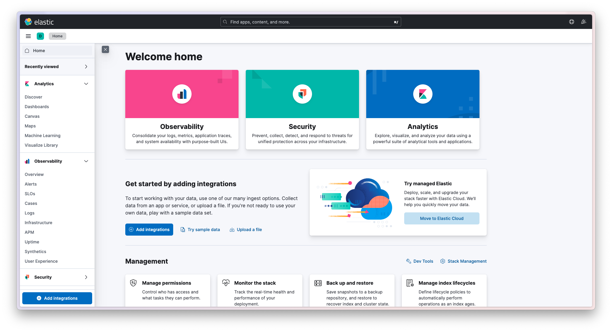
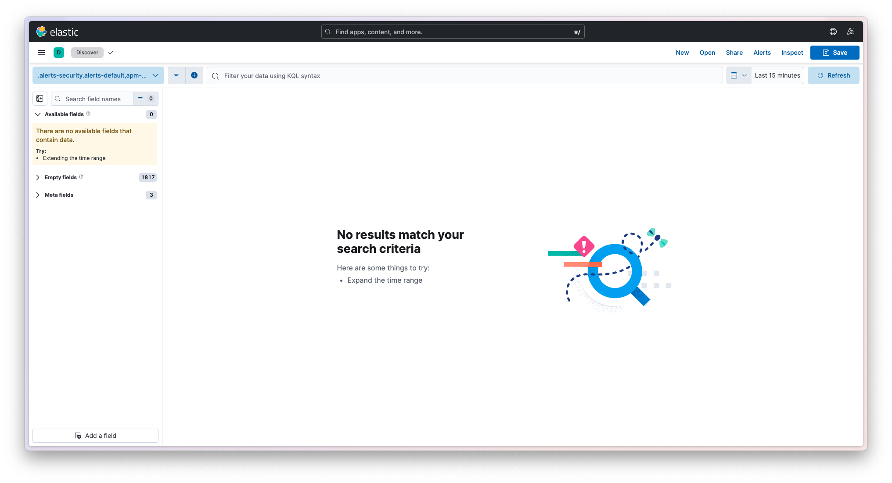
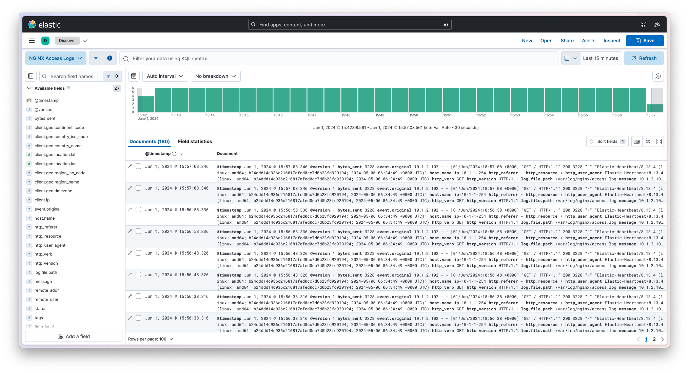
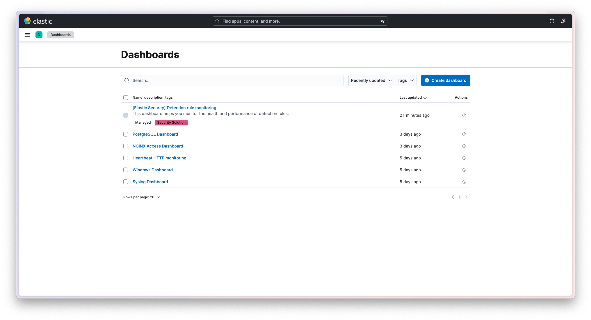
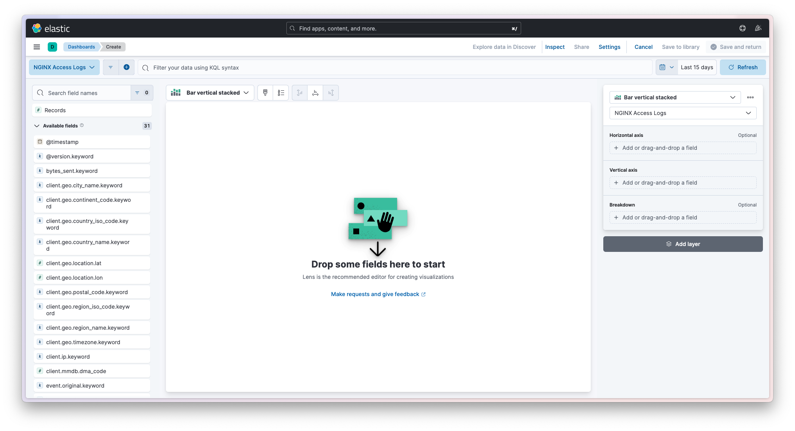
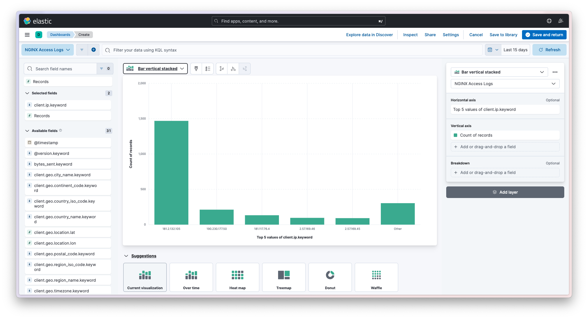
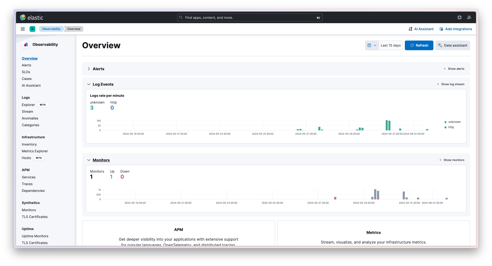
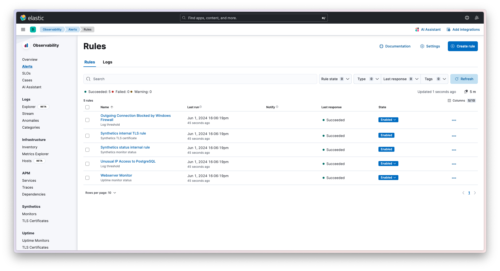
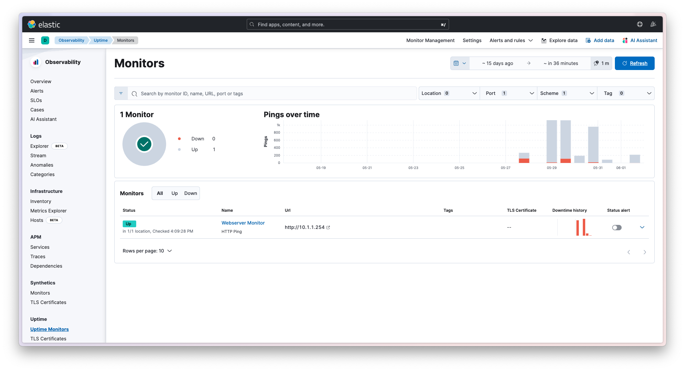

# Usando Kibana

## Prerrequisitos

Se debe tener instalado y configurado Elasticsearch y Kibana. Para más información, ver [Instalando Elasticsearch y Kibana en Linux](./installing-elasticsearch-and-kibana-in-linux.md). Asimismo, la mayoría de los tutoriales a continuación suponen que los datos ya se encuentran en Elasticsearch; cuando sea necesario, se indicará cómo cargar los datos.

## Ingresando a Kibana

Cuando ingresamos a Kibana, veremos la siguiente página de bienvenida. Es importante recordar que Kibana es una interfaz web, por lo que se accede a través de un navegador web. Por defecto, Kibana corre en el puerto `5601`. Si se expone a través de un proxy reverso, se podrá acceder a través de un URL personalizado.

Al ingresar, veremos la siguiente página:

Lo más importante en esta página es el menú de la izquierda, que contiene las diferentes opciones de Kibana. En la parte superior derecha, se encuentra el botón de ayuda, que contiene enlaces a la documentación oficial de Kibana y a la comunidad de Elastic.

En el menú de la izquierda, hablaremos de las siguientes funcionalidades principales:

- **Analytics > Discover**: Permite explorar los datos almacenados en Elasticsearch.
- **Analytics > Dashboards**: Permite crear visualizaciones y gráficos de los datos.
- **Observability > Overview**: Permite obtener un paneo general de la salud de los servicios y aplicaciones.
- **Observability > Stream**: Permite visualizar los logs de los servicios y aplicaciones en tiempo real.
- **Observability > Alerts**: Permite configurar alertas para monitorear los servicios y aplicaciones.
- **Observability > Uptime Monitors**: Permite monitorear la disponibilidad de los servicios y aplicaciones.
- **Management**: Permite gestionar los índices y las funcionalidades principales de Kibana.

> [!TIP]
> Kibana es una aplicación web stateless. Utiliza la REST API de Elasticsearch para interactuar con los datos, así como para guardar sus configuraciones y visualizaciones. Esto permite que Kibana sea altamente escalable y se pueda desplegar en un entorno de alta disponibilidad. Se pueden tener múltiples instancias de Kibana para que se conecten a un único cluster de Elasticsearch, y balancear la carga entre ellas, sin necesidad de configurar todas las visualizaciónes y dashboards en cada instancia.

## Analytics

En esta sección se concentran las funcionalidades de análisis de datos de Kibana. En principio, se pueden explorar los datos almacenados en Elasticsearch, crear visualizaciones y gráficos, y luego combinarlos en un dashboard.

### Discover

La opción **Discover** permite explorar los datos almacenados en Elasticsearch. Al ingresar a esta sección, veremos una pantalla similar a la siguiente:

Podemos ver que no hay datos aún. Esto es porque no hemos creado ninguna _data view_ (vista de datos) en Kibana, sino que estamos viendo el que se nos presenta por defecto.

Clickeando en el botón celeste de arriba a la izquierda, desplegaremos todas las _data views_ disponibles. Seleccionando cada una de ellas, veremos diferentes datos, correspondientes a diferentes índices de Elasticsearch.

Clickeemos en el botón "Create a data view" para crear una nueva vista de datos. Se nos desplegará el siguiente panel. Aquí podremos seleccionar el índice o índices de Elasticsearch que queremos explorar, y podremos elegir un nombre para la vista de datos. 

La selección de índices de Elasticsearch se realiza utilizando expresiones regulares. Como se mencionó en el tutorial [Instalando Elasticsearch y Kibana en Linux](./installing-elasticsearch-and-kibana-in-linux.md), los índices de Elasticsearch se crean automáticamente, y es buena práctica nombrarlos de manera que se puedan identificar fácilmente. Por ejemplo, si se tienen datos de logs de un servidor web, se podría nombrar a los índices como `webserver-2024.01.01`, `webserver-2024.01.02`, etc. En ese caso, la expresión regular para ver los datos asociados a esos índices sería `webserver-*`.

Una vez seleccionados los índices, clickeamos en el botón "Save data view to Kibana". Si hay datos en Elasticsearch, veremos una pantalla similar a la siguiente:

Aquí podemos ver los datos almacenados en Elasticsearch. En el panel izquierdo, podemos ver los campos de los datos, y podemos seleccionar cuáles queremos ver en la tabla. En la parte central, podemos ver los datos en sí.

> [!IMPORTANT]
> Los campos disponibles dependerán de los datos almacenados en Elasticsearch. Por consiguiente, dependerá del pipeline de Logstash utilizado para enviar los datos a Elasticsearch.

En la parte superior, podemos ver un campo de búsqueda, que nos permite buscar datos específicos utilizando Kibana Query Language (KQL) o Lucene. También podemos ver un campo de filtro, que nos permite hacer lo mismo pero de manera visual.

### Dashboards

La opción **Dashboards** permite crear visualizaciones y gráficos de los datos almacenados en Elasticsearch, y luego combinarlos en un dashboard. Al ingresar a esta sección, veremos una pantalla similar a la siguiente:

En la imagen, se pueden ver algunos dashboards creados. Es posible que no haya ninguno, si es la primera vez que se ingresa a esta sección. Para crear un nuevo dashboard, clickeamos en el botón "Create dashboard". Se nos desplegará un lienzo en blanco. Una vez que tengamos visualizaciones y gráficos creados, veremos algo similar a la siguiente imagen:

En la parte superior izquierda, podemos ver el botón "Create visualization" que nos permite agregar visualizaciones y gráficos al dashboard. En la parte superior derecha, podemos ver el botón "Save" que nos permite guardar el dashboard.

Para crear una visualización, clickeamos en el botón "Create visualization". Se nos desplegará un panel similar al siguiente:

En el menú de la izquierda, podremos ver la lista de los diferentes campos que tenemos disponibles en los datos almacenados para visualizar.

Una vez que seleccionamos uno, podremos ver en el centro una primera vista previa. El tipo de gráfico seleccionado es el que mejor se ajusta a los datos según Kibana. En la parte superior, podemos ver un botón que nos permite cambiar el tipo de visualización. Asimismo, en la parte inferior tendremos las opciones más utilizadas. Por último, en el panel derecho podremos configurar la visualización. Las opciones dependerán del campo a visualizar y del tipo de gráfico.

Una vez que hayamos configurado la visualización, clickeamos en el botón "Save and return" para guardarla y agregarla al dashboard.

Vale la pena mencionar que Kibana permite elegir con exactitud el periodo de tiempo que se quiere visualizar. En la parte superior derecha, podemos ver un campo de selección de tiempo. Al clickear en él, se desplegará un panel que nos permitirá seleccionar el periodo de tiempo que queremos visualizar, con lujo de detalle. Esto es muy útil para analizar tendencias y comportamientos en los datos y se puede encontrar a lo largo de todas las secciones de Kibana.

## Observability

En esta sección se concentran las funcionalidades de monitoreo de servicios y aplicaciones de Kibana. En principio, se pueden obtener un paneo general de la salud de los servicios y aplicaciones, visualizar los logs en tiempo real, configurar alertas y monitorear la disponibilidad de los servicios y aplicaciones.

### Overview

La opción **Overview** permite obtener un paneo general de la salud de los servicios y aplicaciones. Al ingresar a esta sección, veremos una pantalla similar a la siguiente:

Podremos ver a simple vista la cantidad de logs que se están recibiendo en tiempo real, la cantidad de alertas que se han disparado, y la cantidad de monitores de disponibilidad que se están ejecutando.

### Stream

La opción **Stream** permite visualizar los logs de los servicios y aplicaciones en tiempo real. Al ingresar a esta sección, veremos una pantalla similar a la siguiente:

En esta pantalla veremos todo lo que está llegando a Elasticsearch, sin ningún tipo de filtro ni procesamiento, con el objetivo de poder ver en tiempo real lo que está sucediendo en los servicios y aplicaciones. Para vistas más amigables o filtros personalizados se recomienda utilizar la sección de Analytics.

### Alerts

> [!IMPORTANT]
> Para poder utilizar las funcionalidades de alertas de Kibana, se debe configurar una clave de encriptación en el archivo de configuración de Kibana. Este es un string de 32 caracteres o más que se utiliza para encriptar información sensible, como credenciales de un servidor SMTP. Se debe agregar la siguiente línea al archivo de configuración de Kibana, que por defecto se encuentra en `/etc/kibana/kibana.yml` en Linux: `xpack.encryptedSavedObjects.encryptionKey: "<clave>"`. Para más información, ver la [documentación oficial de Kibana](https://www.elastic.co/guide/en/kibana/current/alert-action-settings-kb.html).

La opción **Alerts** permite configurar alertas para monitorear los servicios y aplicaciones. Al ingresar a esta sección, veremos una pantalla similar a la siguiente:

Se puede ver un listado de las últimas alertas disparadas, así como un gráfico de las alertas disparadas en el tiempo.

Las alertas se configuran a partir de reglas, que se ejecutan periódicamente y ejecutan una acción si cierta condición se cumple. Para crear una nueva alerta, debemos crear una regla. Para ello, clickeamos el botón "Manage rules" de la parte superior derecha. Se nos desplegará un panel similar al siguiente:

En este panel, podremos ver las reglas existentes, así como crear una nueva regla. Para crear una nueva regla, clickeamos en el botón "Create rule". Se nos desplegará un panel similar al siguiente:

Podemos ver que debemos elegir un nombre y un tipo de regla. Aquí hay muchas opciones, y cada opción podrá tener diferentes configuraciones. Las reglas que desencadenan en alertas más interesantes son las de tipo "Anomaly Detection". Lamentablemente, estas funcionalidades no están disponibles en la versión gratuita de Kibana. Por ello, veremos como ejemplo una regla de tipo "Log Threshold".

Cuando seleccionamos ese tipo de regla, se nos desplegará un panel similar al siguiente:

Vemos dos secciones importantes: "Define rule" y "Define action". En la primera, definimos la condición que debe cumplirse para que la regla se dispare. En la segunda, definimos la acción que se ejecutará cuando la regla se dispare. Vemos que hay muchas opciones de acciones, como enviar un correo electrónico, enviar un mensaje a un canal de Slack, o ejecutar una webhook. Sin embargo, estas funcionalidades no están disponibles en la versión gratuita de Kibana; sólo se puede agregar una entrada a un índice de Elasticsearch o mostrar la alerta en el panel de alertas de manera gratuita.

Una vez que hayamos configurado la regla, clickeamos en el botón "Save rule" para guardarla.

Si clickeamos en la regla, veremos una vista detallada de la misma. En la parte superior, podremos ver un botón que nos permite activar o desactivar la regla. En la parte inferior, podremos ver un botón que nos permite ver las alertas disparadas por la regla. Asimismo, podremos ver el resumen de todas las ejecuciones de la regla, como se ve en la siguiente imagen:

### Uptime Monitors

La opción **Uptime Monitors** permite monitorear la disponibilidad de los servicios y aplicaciones. Al ingresar a esta sección, veremos una pantalla similar a la siguiente:

Podremos ver un listado de los monitores de disponibilidad que se están ejecutando, así como un gráfico de la disponibilidad de los servicios y aplicaciones en el tiempo.

La creación de un nuevo monitor es completamente diferente a todo el resto de recursos de Kibana. No se crea directamente desde la interfaz de Kibana, sino que se importa un archivo de configuración, luego de configurar el monitor utilizando Heartbeat. Para más información, puede verse el tutorial [Monitoreando un servicio con Heartbeat](./monitoring-service-with-heartbeat.md).

## Management

En esta sección se concentran las funcionalidades de gestión de Kibana. Hay cientos de configuraciones para ajustar Kibana a las necesidades de cada organización. Lo más importante que se puede gestionar son los índices de Elasticsearch y los objetos de Kibana, como visualizaciones, dashboards, reglas, monitores, etc.

El manejo de los índices de Elasticsearch se realiza en la sección **Index Management**. Al ingresar a esta sección, veremos una pantalla similar a la siguiente:

Podremos ver un listado de los índices de Elasticsearch, así como información sobre ellos, como el tamaño, la cantidad de documentos, la cantidad de shards, etc. Aquí se podrán configurar reglas de rollover, eliminar índices, y realizar otras tareas de mantenimiento.

El manejo de los objetos de Kibana se realiza en la sección **Saved Objects**. Al ingresar a esta sección, veremos una pantalla similar a la siguiente:

Podremos ver un listado de los objetos de Kibana, como visualizaciones, dashboards, reglas, monitores, etc. Aquí se podrán importar y exportar objetos, así como realizar otras tareas de mantenimiento. Desde esta página se importa la configuración para los monitores.

Otra sección importante de configuración es el de roles y permisos. En la versión utilizada para este tutorial, esa sección no presente pues no se ha configurado el stack de Elastic con certificados SSL y seguridad general. Si se hiciera, se podría configurar roles y permisos para los usuarios de Kibana.
