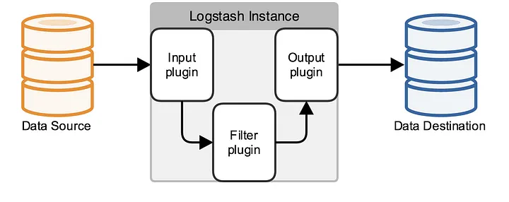

# Utilizar Logstash en Ubuntu

## Prerrequisitos

El repositorio de Elastic no se encuentra incorporado en el repository default de `apt`. Por eso, hay que instalar el repositorio primero, para luego instalar los paquetes requeridos:

1. Importamos la PGP Key de Elastic. Es la clave utilizada para firmar todos sus paquetes
    
    ```Bash
    wget -qO - https://artifacts.elastic.co/GPG-KEY-elasticsearch | sudo gpg --dearmor -o /usr/share/keyrings/elasticsearch-keyring.gpg
    ```
    
2. Instalamos el paquete `apt-transport-https`
    
    ```Bash
    sudo apt install apt-transport-https
    ```
    
3. Instalamos el repositorio de Elastic
    
    ```Bash
    echo "deb [signed-by=/usr/share/keyrings/elasticsearch-keyring.gpg] https://artifacts.elastic.co/packages/8.x/apt stable main" | sudo tee /etc/apt/sources.list.d/elastic-8.x.list
    ```
    
4. Actualizamos los registros de `apt`
    
    ```Bash
    sudo apt update
    ```

## Instalando `logstash`

1. Instalamos `logstash` desde apt
    
    ```Bash
    sudo apt install logstash
    ```
    
2. Generamos la carpeta de logs para `logstash`, para que luego no haya problemas
    
    ```Bash
    sudo mkdir /var/log/logstash
    sudo chown logstash:logstash /var/log/logstash
    sudo chmod u=rwx,g=rx+s,o= /var/log/logstash
    ```
    
3. Configuramos el servicio de `logstash` para que se inicie cuando se inicia la máquina
    
    ```Bash
    systemctl enable logstash
    ```
    
4. Iniciamos el servicio de `logstash`
    
    ```Bash
    systemctl start logstash
    ```
    

> [!NOTE]
> Para probar el funcionamiento de un archivo de configuración, se puede correr Logstash utilizando el siguiente comando: `/usr/share/logstash/bin/logstash -f <path>`


## Configuración de Logstash

La configuración del sistema se encuentra en `/etc/logstash`. Por default, todos los archivos cuya extensión sea `.conf` y estén almacenados en `/etc/logstash/conf.d` serán ejecutados al inciar el servicio.

Logstash trabaja con *pipelines*. Estos consisten de recibir datos de un input, transformar los mismos aplicando filtros y por último depositar el resultado en un output. Todo esto es explicitado en un archivo de configuración para cada *pipeline*.



### Estructura del pipeline

```
# This is a comment.

input {
  ...
}

filter {
  ...
}

output {
  ...
}
```

El archivo de un pipeline tiene tres componentes: `input`, `filter` y `output`. Sus nombres son autoexplicativos.

En cada uno de los componentes, se configura uno o más plugins para que se ejecuten al recibir datos. Por ejemplo, si quisieramos obtener los datos de una conexión HTTP, utilizaríamos el plugin `http` en el componente de `input`. Por otro lado, si quisieramos guardar los datos en una base de datos de Elasticsearch, utilizaríamos el plugin `elasticsearch` en el componente de `output`.

Se puede ver una lista completa de los plugins disponibles en los siguientes URLs:

- Para ver los plugins disponibles para el componente `input`, click [aquí](https://www.elastic.co/guide/en/logstash/current/input-plugins.html).
- Para ver los plugins disponibles para el componente `filter`, click [aquí](https://www.elastic.co/guide/en/logstash/current/filter-plugins.html).
- Para ver los plugins disponibles para el componente `output`, click [aquí](https://www.elastic.co/guide/en/logstash/current/output-plugins.html).

### Ejemplo 1: Logs de NGINX

> [!IMPORTANT]
> El usuario de Linux `logstash` debe tener permisos de lectura en el archivo de logs. Según el archivo que se vaya a leer, múltiples alternativas lo logran: agregar el usuario `logstash` al grupo `adm`, darle permisos de lectura a ese archivo en particular utilizando `chmod`, entre otros.

```
# /etc/logstash/conf.d/example_1.conf

input {
	file {
		path => "/var/log/nginx/access.log"
	}
}

filter {
	grok {
		match => { "message" => "%{IPORHOST:remote_addr} - %{USERNAME:remote_user} \[%{HTTPDATE:time_local}\] \"%{DATA:request}\" %{INT:status} %{NUMBER:bytes_sent} \"%{DATA:http_referer}\" \"%{DATA:http_user_agent}\"" }
	}
	geoip {
		source => "[remote_addr]"
		target => "client"
	}
}

output {
	stdout { codec => rubydebug }
}
```

El componente `input` tiene un único plugin del cual recibe datos. En este caso, se leen los logs del archivo `/var/log/nginx/access.log`

El componente `filter`, encargado de transformar los datos, tiene dos plugins:

- `grok`. Se utiliza para parsear data de logs sin estructura a un objeto estructurado y del cual se pueden hacer consultas. En este caso, se transforma el log de NGINX en un objeto con todos los datos separados en diferentes campos.
- `geoip`. Se utiliza para obtener data a partir de una dirección IP. Se tomará la IP del campo `remote_addr` y se agregará la nueva información en el campo `client`.

Por último, el componente `output` tiene un único plugin: `stdout`. Se imprimirá a pantalla todo el contenido del log. Para que se imprima de una manera más amigable, se utiliza el codec `rubydebug`.

### Ejemplo 2: Logs de NGINX guardados en Elasticsearch

> [!IMPORTANT]
> Si se ha configurado Elasticsearch con seguridad habilitada, se deben seguir los pasos para obtener el certificado SSL y descomentar las líneas comentadas en el siguiente ejemplo. Además, se deben asignar las variables de entorno `ELK_USER` y `ELK_PWD` con las credenciales de acceso a Elasticsearch.

```
# /etc/logstash/conf.d/example_2.conf

input {
	file {
		path => "/var/log/nginx/access.log"
        type => "nginx"
	}
}

filter {
	grok {
		match => { "message" => "%{IPORHOST:remote_addr} - %{USERNAME:remote_user} \[%{HTTPDATE:time_local}\] \"%{DATA:request}\" %{INT:status} %{NUMBER:bytes_sent} \"%{DATA:http_referer}\" \"%{DATA:http_user_agent}\"" }
	}
	geoip {
		source => "[remote_addr]"
		target => "client"
	}
}

output {
	elasticsearch {
		hosts => ["https://localhost:9200"]
        index => "%{[type]}-%{+YYYY.MM.dd}"
		# cacert => "/etc/logstash/certs/http_ca.crt"
		# user => "${ELK_USER}"
		# password => "${ELK_PWD}"
	}
}
```

El único componente que cambió fue `output`, donde se agregó el plugin `elasticsearch`.

Para utilizar dicho plugin, ciertos parámetros deben ser configurados:

1. Se deben setear las variables de entorno `ELK_USER` y `ELK_PWD` con las claves de acceso a ELK; las utilizadas en el tutorial anterior deberían funcionar sin problemas.
2. Se debe setear el URL al cluster de Elasticsearch. En este caso, `https://localhost:9200`.
3. En el caso de que el cluster de Elasticsearch esté configurado con la seguridad habilitada, se debe obtener el certificado SSL con el que Elasticsearch firma sus comunicaciones. Este es un *self-signed certificate* creado cuando se inició Elasticsearch por primera vez. Se debe obtener una copia. En el host que esté corriendo el cluster de Elasticsearch, copiar el archivo `/etc/elasticsearch/certs/http_ca.crt` hacia el host que corre Logstash. Luego, proceda de la siguiente manera:
    1. Suponemos que el certificado se encuentra en `/tmp/http_ca.crt`
    2. Cree un directorio donde Logstash tenga acceso para almacenar el certificado
        
        ```
        sudo -u logstash mkdir /etc/logstash/certs
        ```
        
    3. Mueva el certificado a dicho directorio y asígnele los permisos correspondientes
        
        ```
        sudo mv /tmp/http_ca.crt /etc/logstash/certs/http_ca.crt
        sudo chown logstash:logstash /etc/logstash/certs/http_ca.crt
        ```
        
    4. Listo!
4. Como buena práctica, se utiliza el campo `type` para asignar un tipo a los logs. En este caso, se asigna el valor `nginx`. Luego, en el campo `index` del output, se utiliza el valor de `type` para asignar el índice en el que se guardarán los logs. Por ejemplo, si el log es de tipo `nginx`, se guardará en el índice `nginx-YYYY.MM.dd`, donde `YYYY.MM.dd` es la fecha en la que se guardó el log. Esto permite tener una estructura más ordenada en Elasticsearch y facilita la búsqueda de logs en Kiabana.

Con esto configurado, ya debería ver los logs en Kibana, accediendo a Observability > Logs > Stream.

> [!TIP]
> Todos los pipelines utilizados en los ejemplos se encuentran en el repositorio, bajo el directorio `/files/logstash`.

## Grok

Grok es un plugin de Logstash que permite parsear logs sin estructura a un objeto estructurado. Para utilizarlo, se deben definir patrones que se ajusten a los logs que se quieren parsear.

Dichos patrones mappean partes específicas de la línea en campos dedicados, y se pueden realizar acciones basadas en este mapeo.

La sintaxis de un patrón es la siguiente: `%{TYPE:variable}`. De esta manera, se asigna el valor de la parte de la linea que matchea con `TYPE` al campo `variable`.

Veamos un ejemplo. Tenemos el siguiente patrón:

```text
%{IPORHOST:remote_addr} \[%{HTTPDATE:time_local}\] \"%{DATA:http_verb} %{DATA:http_resource} %{DATA:http_version}\" %{INT:status} %{NUMBER:bytes_sent} \"%{DATA:http_referer}\" \"%{DATA:http_user_agent}\"
```

Este patrón matchea con la siguiente línea:

```text
181.117.76.4 [27/May/2024:19:10:32 +0000] "GET / HTTP/1.1" 304 0 "-" "Mozilla/5.0 (Macintosh)"
```

Así, se generaría el siguiente objeto:

```json
{
    "remote_addr": "181.117.76.4",
    "time_local": "27/May/2024:19:10:32 +0000",
    "http_verb": "GET",
    "http_resource": "/",
    "http_version": "HTTP/1.1",
    "status": 304,
    "bytes_sent": 0,
    "http_referer": "-",
    "http_user_agent": "Mozilla/5.0 (Macintosh"
}
```

Una buena página web para testear los patrones de Grok es [Grok Debugger](https://grokdebug.herokuapp.com/).